# Calculating Bicycle CdA (Coefficient of Drag Area) — DRAFT


## Contents

- [Introduction](#introduction)
  - [The Power Balance Equation](#the-power-balance-equation)
- [The Solution](#the-solution)
  - [Garmin-only](#garmin-only)
  - [Garmin + Sensor Hub](#garmin-sensor-hub)
  - [Sensor Hub](#sensor-hub)
  - [Airspeed Sensor Placement](#airspeed-sensor-placement)
  - [Physical connections ESP32](#physical-connections-esp32)
- [Development Stages](#development-stages)
  - [Breadboard](#breadboard)
  - [Working Prototypes](#working-prototypes)
- [Appendices](#appendices)
  - [Appendix 0-1 — Accounting for Rolling Mass](#appendix-0-1-accounting-for-rolling-mass)
  - [Appendix 0-2 — Development Environments](#appendix-0-2-development-environments)
  - [Appendix 0-3 — Sensor Details](#appendix-0-3-sensor-details)
  - [Appendix 0-4 — ESP32 Logging and Persistence Workflow](#appendix-0-4-esp32-logging-and-persistence-workflow)
  - [Appendix 0-5 — Handling Two Clocks](#appendix-0-5-handling-two-clocks)
  - [Appendix 0-6 — Microcontroller Hardware](#appendix-0-6-microcontroller-hardware)

## Introduction

This document outlines the development of a CdA estimator for Garmin
Edge computers with power meter sensors.

The CdA estimator helps riders optimize position and equipment for
maximum speed. Once restricted to wind tunnels or expensive specialized
sensors, low-cost technologies from drones and IOT, now enables DIY
solutions. These tools offer a practical way to refine performance in
real-time.

The solution scales from basic Garmin headset data to the use
higher-precision external sensor data. It uses the most accurate
variables available, with built-in fallbacks to less reliable data
sources.

We solve the real-time *Bicycle Equations of Motion*, because cyclists
are flexible bodies on a bike; shifting positions alter both frontal
area and shape.  To account for this, we combine the Coefficient of Drag
(Cd) and Area (A) into a single metric—CdA

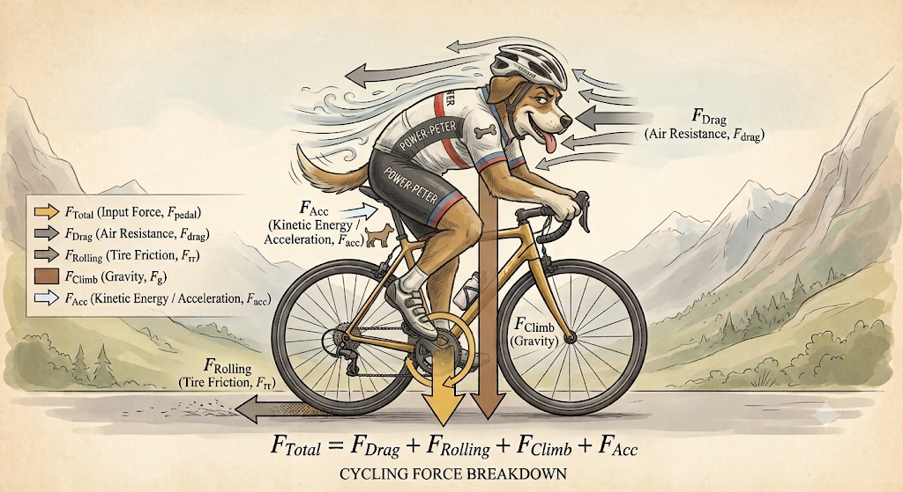

CdA estimation relies on categorizing power consumption components,
isolating the Drag, then breaking out the CdA. CdA values are saved to
the FIT file with standard Garmin metrics. Granular metrics and raw
calculations are stored in the external sensor log when connected and
configured.

**<u>GARMIN Head Unit</u>**

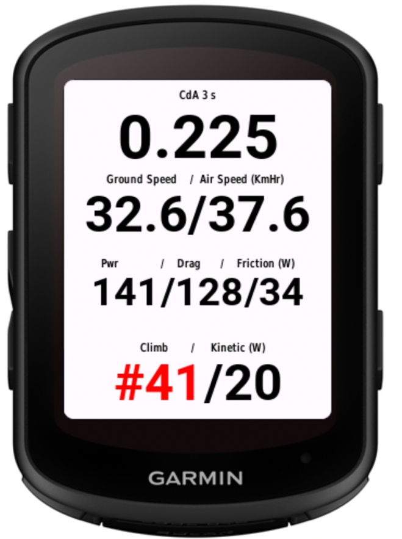

This is an entertaining programming problem, and an introduction to
sensor technologies, I’ve become a fan of the M5Stack
(<https://m5stack.com/>) products, easy to understand and connect. The
boring or technical bits are in the appendixes.

### The Power Balance Equation

All physics models are effective; an effective model intentionally
ignores microscopic complexities to describe the macroscopic behavior;
it uses insufficient or incomplete details and over simplifications that
become invalid in some circumstances - that's the warning.

The CdA estimator uses a physics-based power balance equation to isolate
aerodynamic drag from other power consuming forces:

P_total = P_drag + P_rolling + P_climb + P_kinetic + P_drivetrain_loss

Expanded form:

P_total = ½ρ·CdA·v_air²·v_road + C_rr·m·g·v_road + m·g·(dh/dt)
          + ½m·d(v_road²)/dt + P_drivetrain_loss

**P_total:** Power measured by a power meter.

**Drag:** Power required to overcome aerodynamic resistance. This is the
quantity isolated for the CdA calculation:

P_drag = ½ρ·CdA·v_air²·v_road

P_drag = P_total − (P_rolling + P_climb + P_kinetic + P_drivetrain_loss)

**Rolling:** Power consumed by tire rolling resistance. The tire contact
patch deforms and recovers but does not return all the energy used to
deform it. The simplified equation is:

P_rolling = C_rr·m·g·v_road

Rolling resistance also depends on slope and road surface, but this
effective model ignores those effects. For clinchers with latex tubes,
C_rr is approximately 0.0035–0.0045. At 36 km/h and a combined bicycle
and rider mass of 90 kg, this corresponds to roughly 31–40 W. Published
C_rr values are available for major tire brands.

**Climb:** Power consumed or contributed by the rate of change in
gravitational potential energy:

P_climb = m·g·(dh/dt)

Here, dh/dt is vertical speed. It can be estimated using barometer or
accelerometer data. Small errors are significant. For example, a 90 kg
combined bicycle and rider climbing at a road speed of 5 m/s on a 10%
gradient has a vertical speed of approximately 0.5 m/s and requires
about 441 W for climbing alone. Descending makes this term negative.

**Kinetic energy:** Power consumed while accelerating or contributed
while decelerating:

P_kinetic = ½m·d(v_road²)/dt = m·a·v_road

No change in kinetic energy indicates constant velocity. To approximate
the rotational inertia of the wheels, the model multiplies mass by an
INERTIA_FACTOR of 1.04 when calculating kinetic power.

**Drivetrain:** Chain and bearing friction typically consume about 2–3%
of rider power. The model uses:

P_drivetrain_loss ≈ 0.025·P_total

This is approximately 5 W at 200 W. The display combines drivetrain and
rolling losses under “Friction”; both treatments are simplifications.

**ρ (air density):** Calculated using pressure, temperature, and humidity
sensors. Air density affects aerodynamic drag and the altitude estimate
used for climbing power. The simplified dry-air equation is:

ρ = P/(R_specific·T)

- **P (absolute pressure):** Pascals (Pa).
- **R_specific (dry-air gas constant):** Approximately 287.058 J/(kg·K).
- **T (absolute temperature):** Kelvin (K).

> *Notes:*

- 1,000 m elevation gain, reduces air density by about 10%.

- 10C temperature increase reduces air density by about 3%.

- At 30C and 90% humidity, the air density is about 0.6% to 0.8% lower
  than dry air 0% humidity, resulting in CdA will appear roughly 0.7%
  lower. Humidity correction not discussed here.

**v_air:** Airspeed in the direction of travel. Tail
winds and yaw are not considered when present, air speed may be
under-estimated. Basic sensors have reliable lower reading ranges of
roughly 10–15 km/h (3–4 m/s), below 10 km/h, the sensor may drift up
randomly even if the bike is still.

**v_road:** Ground speed. The Garmin GPS can lag by 3
seconds or drop out, so wheel magnet measurements are desirable. (using
Speed and Velocity interchangeably here)

**C_rr:** Coefficient of rolling resistance, a
dimensionless value that estimates tire energy loss; ratio of force
required to keep a tire rolling to vertical load (weight).

**m:** Combined mass of the rider and bicycle: rider mass + bicycle
mass.

**g:** Earth’s gravitational acceleration at the surface, approximately
9.81 m/s².

## The Solution

The application is a Connect IQ Data Field that operates in two modes:

- Garmin-Only mode using internal sensors

- Garmin + Sensor Hub mode that fuses data from an external Sensor Hub
  via Bluetooth Low Energy (BLE) messages.

#### User Interface

Indicates if using sensors and averaging duration

The display shows the current CdA, or a status message such as “Slow”
or “Wait”. It also shows ground speed from GPS or a wheel magnet and
airspeed from the sensor.


Power meter reading/ estimated power loss to aero drag/ loss to tire and
drive train friction

Power from PE and KE.

contribution indicated by \#

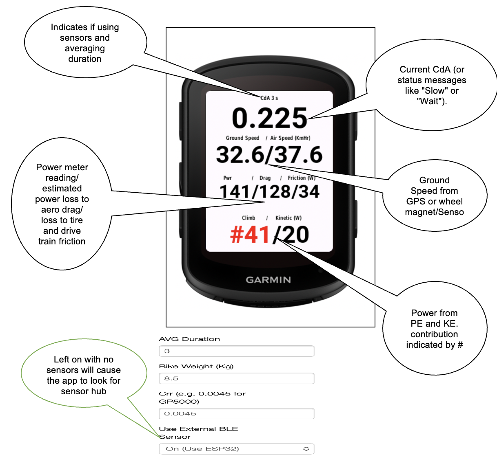

Left on with no sensors will cause the app to look for sensor hub

Garmin headsets can’t easily send commands or data to the sensor hub,
e.g.: send the defined, wheel circumference or recorded rider mass.
However, it’s possible by attaching BLE messages to button presses. (not
tested this one).

#### CdA Graph

Example test data stream


### Garmin-only

Garmin’s OS collects raw metrics, processes them through internal filters, and populates a single `Activity.Info` snapshot once per second (1 Hz).

```text
[GPS Satellites] ───────┐
[Internal Barometer] ───┼──> [Garmin OS Engine] ──> [Activity.Info Snapshot] ──> Data Field
[ANT+ Power/HR] ────────┘        (Processes & Filters)       (Once Per Second)       (compute() loop)
```

Using only the Garmin headset, the values of from Garmin's sensors are
used, together with the mandatory external Power Meter readings, and
configurations.

- **Dynamic Configuration**: reads settings from Garmin Connect IQ,
  (e.g.: AVG_Duration, Bike Weight, Body Weight in Profile), that change
  model's sensitivity without recompiling.

- **Metrics**:  Buffers are kept for key data for user defined duration:


- **Altitude**

  - Garmin's absolute altitude readings are smoothed by a Kalman filter.

  -  Garmin altitude change is processed by an Exponential Moving
    Average (EMA), where the "responsiveness" of the EMA is calculated
    dynamically based on user-defined duration - the average in seconds
    to be reported..

    - Stored in an array of size duration, and avgVerticalSpeedMS
      calculated by summing over duration, and dividing by duration,
      this is used in climb power calculation. When sensors are
      available the value is augmented with sensor data.


- **Speed**

  - speedAvgMSec uses Simple Moving Average (SMA) for duration

  - currentSpeedSqDiff, used to estimate Kinetic Energy power:

    - A Jitter Threshold is applied so likely noise are zeroed out
      before being stored .

    - currentSpeedSqDiff uses Simple Moving Average (SMA) for duration.


- Drag factor (speedAirSensorMSec \* speedAirSensorMSec) \* speedMSec
  with no sensors, speedAirSensorMSec = speedMSec. It uses a Simple
  Moving Average (SMA) over duration.


- **Density**

  - Info.ambientPressure  and Toybox.SensorHistory is accessed to get
    latest temperature, these are used to calculate air density.

> Without Sensor Hub input these data are used in CdA calculations.

- **Logging:**

  - FIT Recording: CdA values are recorded into the session's FIT file

### Garmin + Sensor Hub

The Garmin-only is extended, the key addition is airspeed. Altitude
information is also provided that augments/ enhances Garmin's.

Garmin Connect IQ apps act as Generic Attribute Profile (GATT) clients
only. Message payload is limited to 20 bytes. Peripheral devices, (GATT
Servers), must chop any payload into packets and send them sequentially,
the Garmin app must rebuild them.

#### External sensor connectivity

- Bluetooth Low Energy, BLE, Management: Scans for specified service
  UUID. Data is passed as delimited strings and reassembled on the
  Garmin, the data meaning is positional.

- Garmin *Activity.Info* is refreshed at 1 Hz; messages from sensor hub
  to Garmin are sent at 250ms, 4 Hz, and used to create a rolling 1 sec,
  (1 Hz), data average and sum for altitude difference. (Note the C++
  and Monkey C parameters must be synchronized). See Appendix 0‑5 -
  Handling Two Clocks.

The following sensors are supported, using the I2C protocol:

| Sensor | Data | Use in CdA calculation | Cost (USD) |
|:---|:---|:---|---:|
| MS4525DO | Airspeed | Pitot/static differential pressure | 25–40 |
| DHT20 + BMP280 | Pressure, temperature, humidity | Altitude and air density | 4–8 |
| BMP390 | Pressure and temperature | High-precision altitude and air density | 10–15 |
| Power meter | Rider power | Total power entering the system | 200–1,000 |
| Wheel-speed magnet | Ground speed | Stable short-timescale speed; preferred over GPS | 15–30 |

*Note: Power Meters and Wheel Magnet Sensors support both ANT+ and BLE*

See Appendix 0‑3 Sensor Details for the hub sensor options

##### Other sensors considered

###### Acceleration Sensor

To provide additional validation data:

- Climb rate: detects changes in vertical velocity (Δv_alt) in the direction of
  gravity, can be used as an additional source for altitude gain.

- Kinetic energy detects changes in road velocity (Δv_road) in the
  direction of travel. An alternative calculation is P_KE = m·a·v_road.

###### Lidar Time of Flight (ToF) or Similar

Integrating a rear-facing, handlebar-mounted micro-LiDAR /Tof camera
could create an automated Aerodynamic Position Classifier. Instead of
treating the rider's shape, the sensors combine with machine learning
models could match distinct geometric postures directly to their
corresponding real-time drag values. Collected data could train a model,
which is then used as classifier for good positions, the VL53L5CX has
been tested and discussed in Appendix. An AI camera with depth
perception is also an option. Logging on SD is mandatory with these
approaches.

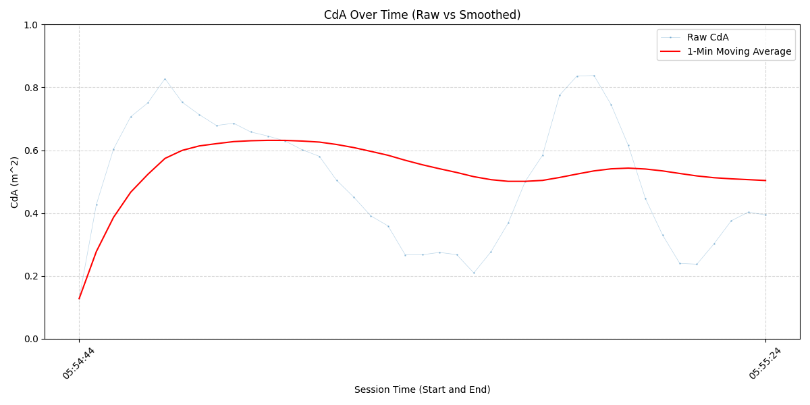

**
**

#### Logical Relationship between Garmin and Sensor Hub

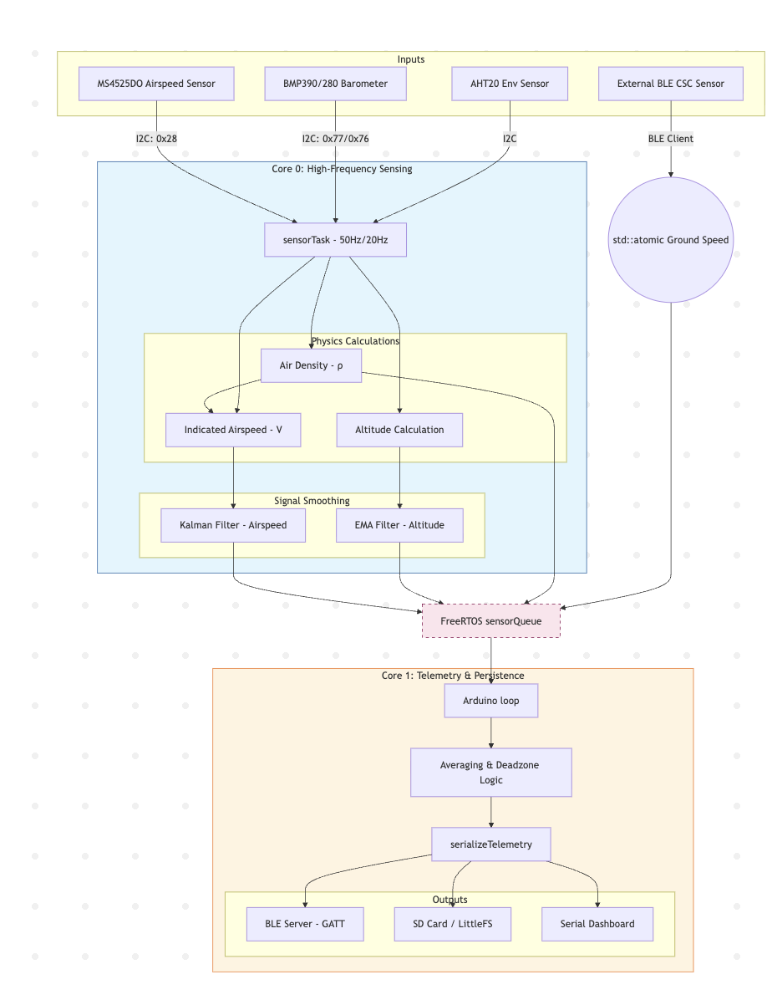

### Sensor Hub

Sensor Hub is based the ESP32-S3, a dual-core architecture micro
controller. Sensor sampling, and communication and storage tasks, can be
decoupled. See Appendix 0‑6 - Micro Controller Hardware.

Below is the ESP32-S3 workflow:

#### ESP32-S3 Boot Sequence

> **Hardware Stabilization:** A 2-second delay when connected.
>
> **Storage Mounting:** If ESP logging set, attempts to mount persistent
> storage.

**Bus Integrity:** Performs a bit-bang test on I2C pins to check for
stuck lines or missing pull-ups before initializing the Wire bus at
100kHz.

> **Sensor Discovery:** Scans the I2C bus for the MS4525DO Airspeed
> sensor and the BMP390/280/ AHT20 sensors, and others if added.
>
> **Calibration:**

- Samples the air for zero-pressure offsets for airspeed.

- Ground-level pressure (for altitude reference), and other if present.

> **Task Launching:**

- Sensor Acquisition Workflow - sensor Task on Core 0

- Aggregation and Telemetry Workflow - loop () on Core 1

> The design assumes dual-core, it was written to also work on a single
> core, without queuing but not fully tested.

#### High-Frequency Acquisition Workflow (sensor Task on Core 0)

This task handles the sensor reads:

> **Sampling:** Sampling is set by sensor, e.g.: 50 milli second 20 Hz.
>
> **Smoothing:**

- Airspeed raw data is passed through a** **Kalman Filter** **

- Altitude uses an Exponential Moving Average (EMA to remove noise.

- Density rolling average calculated

> **Queueing:**  values are put on the Sensor Queue. this decouples
> high-speed sensing from slower transmission and logging tasks.

#### Aggregation and Telemetry Workflow (loop () on Core 1)

Runs the aggregation, logging and transmission:

> **Drain Queue:**

- Create rolling average for point samples, e.g.: airspeed, air density,
  others

- Calculate accumulated altitude change (Climb/Descent) by comparing
  consecutive Altitudes, it uses the last sample from previous
  BLE_PUBLISH_INTERVAL as the starting point to avoid jumping, a 5cm
  dead zone is applied.

> **External Sensor Sync:** Collects data from external sensors e.g.:
> Power Meter, Wheel Road speed magnet, this could allow, the hub to
> bypass the Garmin headset completely, using a display, or publish to
> website.
>
> *Ground Speed*: acts as a BLE Client to a remote cycling speed sensor,
> calculating ground speed based on wheel revolutions (implemented but
> not used - testing too much hassle, originally considered passing the
> complete calculation to Garmin, so it would become only a display
> unit.)
>
> **Formatting:** A subset of data are formatted into a pipe-delimited,
> "\|", string, terminated by "\*". Garmin logic is required to handle
> deformed messages, as they can "go missing".

#### **Logging and Persistence Workflow:** ESP32 logging is optional. ESP32 Non-Volatile Storage (NVS), can use two file systems:

- Secure Digital SD Card (SPI):  high-capacity logging.

- LittleFS (Internal Flash):  if a SD card is not present; this is
  useful in development.

> For local logging HH:MM: SS\|Data\| is added for all data items.
> Standard ESP32 records elapsed time from session start, not actual
> time, which would require a timing chip.
>
> This log can be used for additional analysis, as FIT files require
> detailed setup. it's available in the development environment. When
> connected to development Serial Monitor a command menu is available:

**Operational commands**

- S — Toggle logging (start/stop)
- D — Flush the buffer and dump the log file
- I — Show storage and file status
- C — Clear/delete the log file
- H — Halt the system and stop all tasks
- V — Toggle dashboard view
- M — Show the menu again

> **Transmission**
>
> Messages are chunked and transmitted.

#### Sensor Hub Logical Flow

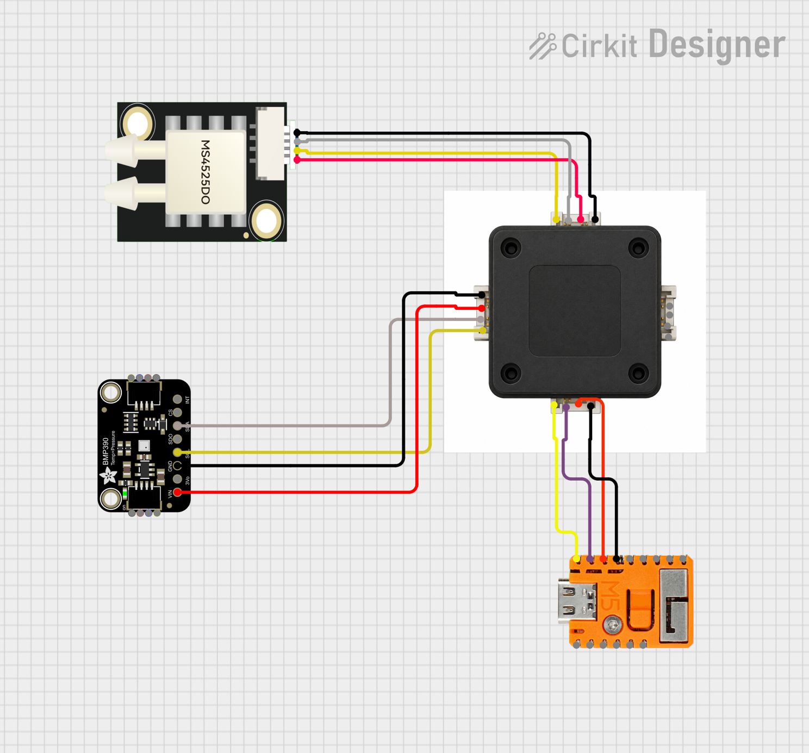

#### Sensor Fusion

Sensor fusion combines data from multiple sensors to get result that is
more accurate/reliable, than a single sensor. Sensors operate with
different accuracy, potentially measuring complementary observables. The
"fusion" of sensor result can produce more accurate overall
measurements. Fusion combined with smoothing and Kalman filters, (see
Internet for many explanations), provide the best results. Some sensor
combinations:

| Sensor fusion | Output | Usage in CdA model |
|---|---|---|
| MS4525DO + BMP390 | Airspeed | BMP390 supplies pressure for altitude and temperature for air-density calculation. MS4525DO falls back to a fixed air-density value and its internal temperature. |
| MS4525DO + DHT20 + BMP280 | Airspeed | BMP280 supplies pressure for altitude and air-density calculation. DHT20 supplies the preferred temperature measurement when available. |
| DHT20 + BMP280, or BMP390, combined with Garmin altitude | Altitude change | A complementary filter assigns 90% weight to the external sensor and 10% to Garmin altitude. If external data is unavailable, Garmin receives 100% weight. |
| BMP390, or DHT20 + BMP280 | Air density | Overrides the Garmin air-density calculation. |

### Airspeed Sensor Placement

Poor placement of this senor will make the airspeed calculation useless,
use this criteria:

- The sensor must not be is the wash of the front wheel.

- The sensor must not be so close to the frame and rider, that changes
  in the riders position, (which we are analyzing), changes the airflow
  around the sensor. We are trying to independently measure the
  airspeed.

- The stem to should be rigid enough that its movements are not
  generating its own airflow.

### Physical connections ESP32

Below is the connection layout using I2C (power supply not shown). The Grove standard uses the following:

- **Pin 1 — SCL (yellow):** Serial clock line for timing synchronization.

- **Pin 2 — SDA (white):** Serial data line for sending and receiving bits.

- **Pin 3 — VCC (red):** Power supply, typically 3.3 V or 5 V depending on the device.

- **Pin 4 — GND (black):** Common ground reference.

Care of the pin order is needs attention, every vendor, unless 'real'
Grove may have a different layout.( Note: M5 allows redefinition of the
Grove connector GPIO ports)

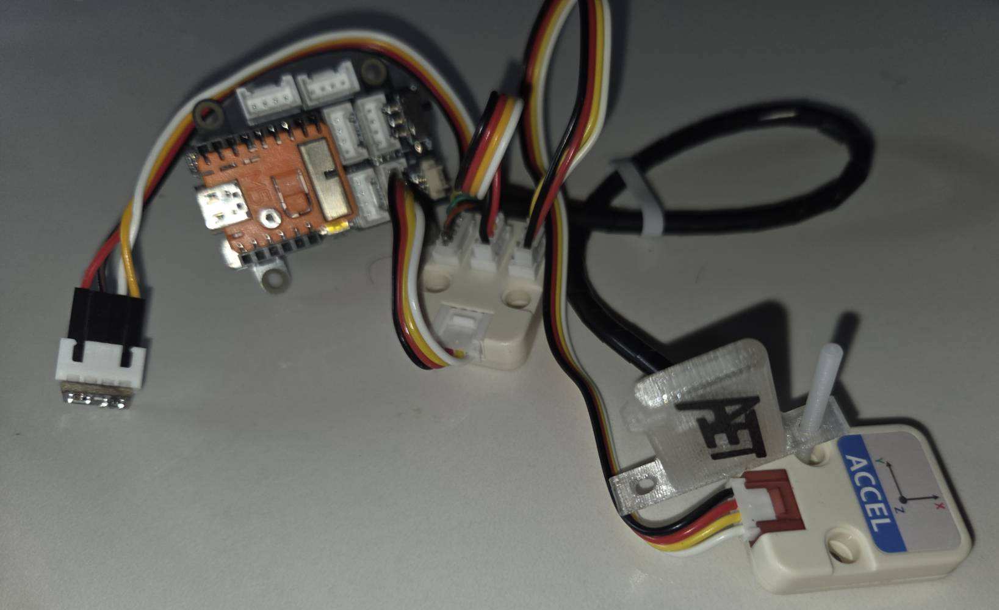

## Development Stages

This section shows some pictures of the development stages:

### Breadboard

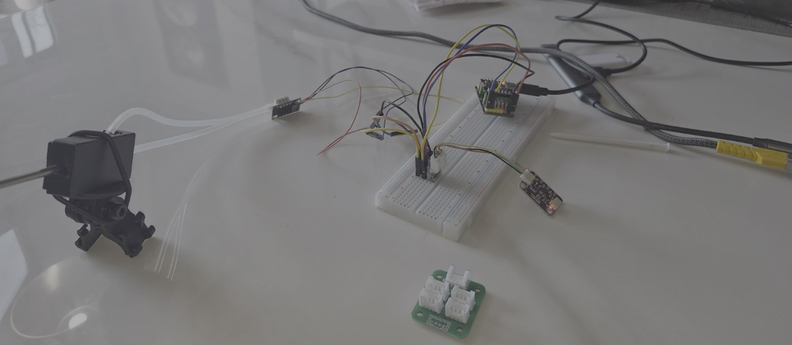

ESP32 Dev board connected to Garmin Simulator

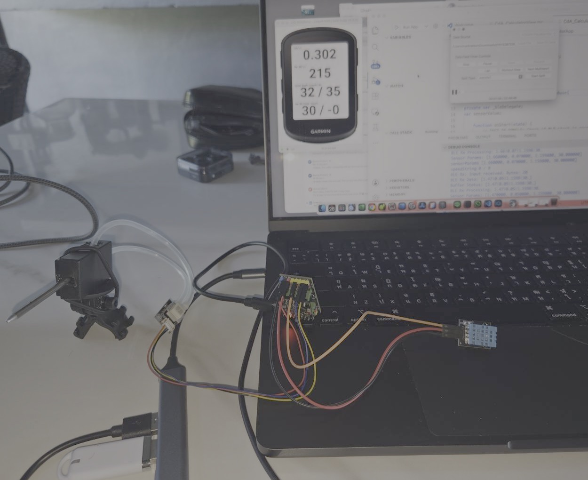

### Working Prototypes

Both of the solution below work, its possible to make more streamlined
solutions, (using the M5Stamp Capsule would simpliify wiring). The
neater approach would be a custom PCB board, the relevent chips mounted,
and waterproofed.

**Integrated sensor prototype:** Small airspeed sensor, BMP280,
multi-port Grove adapter, and built-in battery.

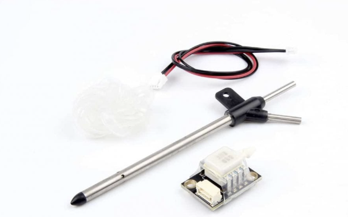

**External Pitot-tube prototype:** Airspeed sensor with external Pitot
tube and BMP390; requires an external battery.

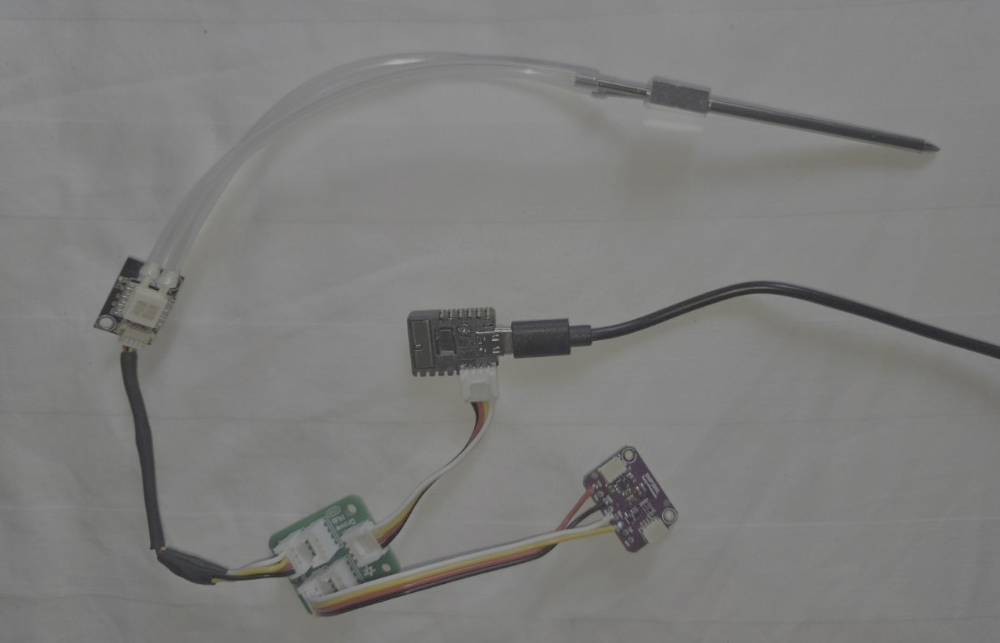

## Appendices

### Appendix 0-1 — Accounting for Rolling Mass

To account for wheel inertia, the total kinetic energy should include
translational and rotational components, as all acceleration consumes
energy:

- Linear Kinetic Energy: depends on the total mass (m) and velocity (v).

- Rotational Kinetic Energy: depends on spinning the wheels (moment of
  inertia I) at angular velocity ω.

For a bicycle wheel, the effective "rotational mass" is roughly equal to
the actual mass of the wheel, the Rule of Thumb: 1 kg of wheel weighs 2
kg when accelerating.

#### *Effective Mass*

For the CdA calculation, use effective mass m_eff instead of static
mass. This gives the kinetic-power equation:

P_kinetic = m_eff·a·v

m_eff = m_total + ΣI/r²

- **m_total:** Rider + bicycle + equipment.

- **I:** Moment of inertia of the wheels.

- **r**: Radius of the wheel (approx. 0.335m for 700c).

#### *Estimating "I"*

The I value changes between a climbing wheel and a disc wheel.

| **Wheel Type**       | **Approx. Inertia (I)**          | **I/r2 (Add-on Mass)** | **Total "Inertial Penalty"** |
|----------------------|----------------------------------|------------------------|------------------------------|
| Light Climbing Wheel | ≈ 0.10 kg·m²                     | 1.6 kg                 | approx. 1.8 kg per pair      |
| Deep Section (80mm)  | ≈ 0.14 kg·m²                     | 1.2 kg                 | approx. 2.4 kg per pair      |
| Rear Disc Wheel      | ≈ 0.18 kg·m²                     | 1.6 kg                 | approx. 3.2 kg (rear only)   |

#### *Implementation in CdA Calculation*

In the Monkey C code, a Moment of Inertia Factor INERTIA_FACTOR for 700c
wheels, this factor is roughly 1.03 to 1.05.
m_eff = m_total·INERTIA_FACTOR
INERTIA_FACTOR = 1.04, is used.

### Appendix 0-2 — Development Environments

#### Garmin Monkey C Development: VS Code + Connect IQ (CIQ) SDK

Use a standard install.

To work with BLE the Garmin Simulator needs the Nordic nRF52-DK or
nRF52840 Dongle, and associated software. Practically the dongle is the
cheapest/simplest solution. Read Garmin's install docs. Flashing the
dongle may require going back a few versions to get it working

Referencing BLE in anyway in simulator code without a dongle, will bring
the simulator down, these errors can't be trapped in Try/Catch, (at
least the mac). If coding/testing without BLE the relevant code must be
by-passed. The following parameters in the CdA_Utilities.mc are relevant
to development.

const DEBUG = true;

const BLE_DEBUG = true;

var USING_SENSOR = true;

const TESTING_WITH_FAN = true;

DEBUG -- Prints contents if DEBUG print lines

BLE_DEBUG - Prints contents if DEBUG in BLE connection area

USING_SENSOR -- When "false" all code connecting to BLE is bypassed.

TESTING_WITH_FAN -- When "true" assume simulation data generated or a
FIT file is being played, with connected airspeed sensor that's pointed
at a fan, the value of Air Speed used in the application becomes the
((ground speed from FIT file/Sim) + Sensor Input); this gives a more
realistic simulation.

#### ESP32 development: VS Code + PlatformIO

The code is all built with PlatformIO for the ESP32 development – if you
select something else, then some playing around with the configuration
file will be required.

### Appendix 0-3 — Sensor Details

All sensors used, follow Inter-Integrated Circuit, **I**2C standard,
*I-squared-C*, a synchronous, multi-device communication protocol used
to connect peripherals to microcontrollers. It uses:

- *SDA (Serial Data):* send and receive data bits.

- *SCL (Serial Clock):* clock signal generated by the master device to
  synchronize the timing of the data transfer.

Sensors supporting I2C will have these pins, but the order and connector
sizes are not standard:

- Grove standard 2.0mm pitch connector, also called HY2.0 - with buckle.

- Qwiic and STEMMA QT standard uses 4-pin JST SH connector with a 1.0mm
  pitch, the VCC pin always needs checking

- 1.25mm pitch JST 4-pin connector

All connections need checking, convertors are not generic as pin layouts
change, (hint: stay Grove, when possible). Wire splicing is the
solution, unless you want to buy 1000 connectors on Alibaba.

#### Airspeed Sensor MS4525DO

A pitot-static tube measures velocity by comparing total pressure with
static pressure.

- Total Pressure: front-facing opening that points directly into the
  wind. As the bike moves, the air converts its kinetic energy into
  pressure.

- Static Pressure: small holes located perpendicular to the airflow
  measure the ambient atmospheric pressure without the influence of the
  bike's forward movement.

v_air = √[2(P_total − P_static)/ρ]

Note the importance of **ρ (air density)**; it is used in
both the v_air calculation and the drag
calculation.

The MS4525DO is a differential pressure I2C sensor, show in two form
factors below:


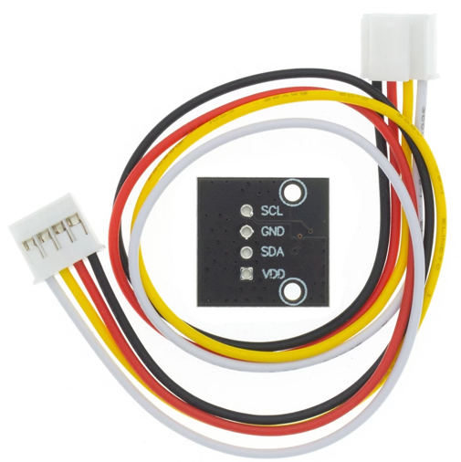

#### Altitude sensors AHT20+ BMP280

AHT20 + BMP280 module is a I2C sensor board providing temperature,
humidity, and atmospheric pressure data. It has the AHT20
(humidity/temp) and BMP280 (pressure/temp). Theoretical Sensitivity
Limit of approx 11cm, practical 1m. The AHT20 provides temperature
accuracy of ±0.3°C, compared with approximately ±0.5°C to ±1°C for the
BMP280.


#### Altitude sensors BMP390

BMP390 is the upgrade to the BMP280. Comparing the BMP390 and BMP280:

- Theoretical Sensitivity Limit of approx 1.7cm practical 0.25m (This is
  the most important benefit of this sensor)

- BMP390 and BMP280 are not pin-to-pin compatible and use different
  addresses.

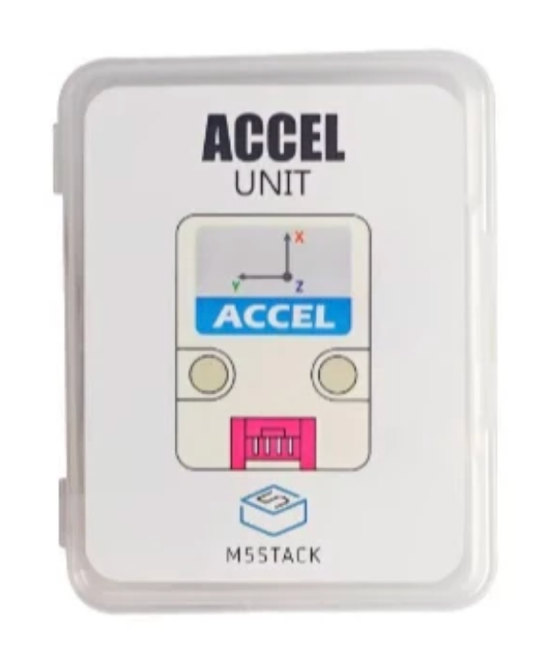

BMP390 measures temperature for internal compensation, this calibrated
temperature data published via I2C. Accuracy is ±0.5°C with 0.005°C
resolution, making it approximately 0.2°C less accurate than the AHT20.

#### Accelerometer + Gyroscope (hypothetical)

ACCEL is a motion sensor.. With ADXL 345 and ACC, 3-axis speed can be
derived.

• **3-Axis Measurement:** Measures acceleration in the X, Y, and Z
directions.

• **Sensitivity:** Measures up to ± 16g with high 13-bit resolution,
allowing it to detect tilt changes of less than 1.0°.

• **Digital Outputs:** Data is output as a 16-bit.

• **Communication:** c**I2C** or **SPI** digital communication
protocols.

• **Special Features:** Includes built-in motion sensing, such as
detecting tap/double-tap events, general activity, and inactivity

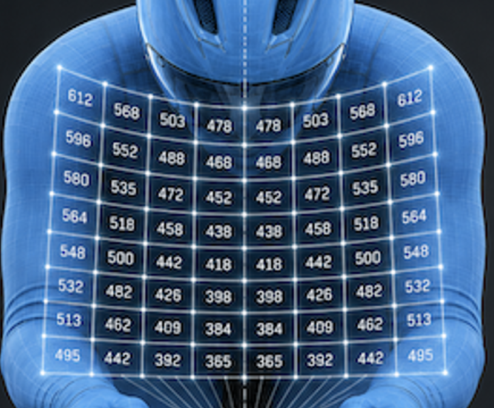

The M5Stack Capsule (ESP32) has BMI270 is a 6-axis Inertial Measurement
Unit (IMU), It combines a 3-axis Accelerometer and a 3-axis Gyroscope.
I've tested a 1 US accelerometer; the results are compatible with
checking the delta velocities.

##### Lidar, ToF or AI camera

The VL53L5CX is a time-of-flight (ToF) multi-area sensor, and can
measure precise distances regardless of target color and reflectivity.
It provides an accurate range of up to 400 cm and operates at high
speeds (60 Hz.



The multi-spatial distance measurement system can achieve an area of ​​up
to 8x8, 63° wide field of view, which can be reduced with software. The
VL53L5CX can detect various objects within its field of view using STF
Semiconductor's patented histogram algorithm. The histogram algorithm
can also suppress crosstalk of cover slides exceeding 60 cm.

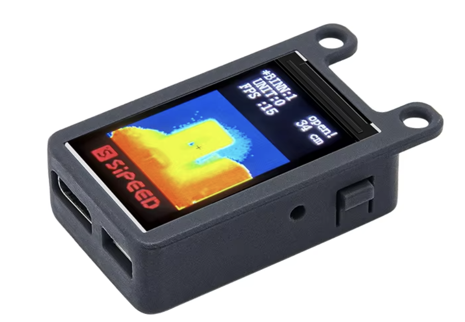

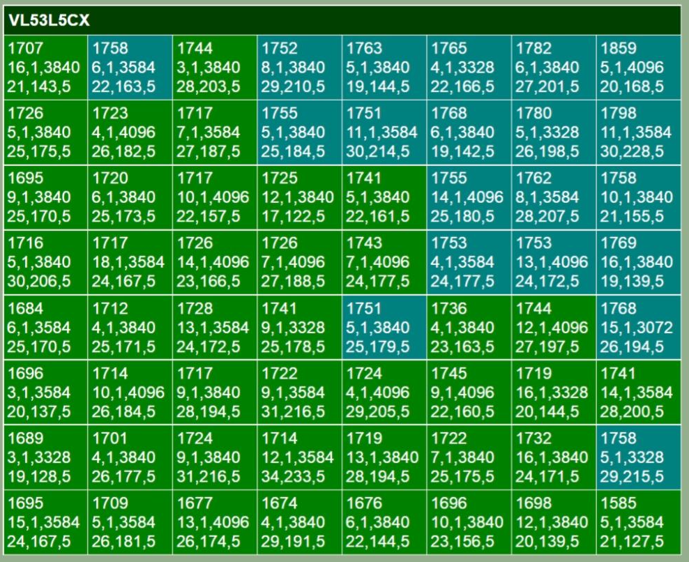

SPAD: Single-Photon Avalanche Diode

- Solid-state photodetector. It acts like a digital light switch it can
  detect and count individual light particles (photons).

- SPADs are used in time-of-flight cameras and LiDAR.

- **kcps/spads** stands for **kilo counts per second per SPAD**, which
  is a unit of measurement used to quantify light signal strength in
  advanced photon-detecting and ranging sensors.

Reading the output table Output

Line 1. distance in mm

Line 2. ambient noise kcps/spads, no of valid targets detected, no
spads, no spads enabled for range

Line 3. Signal returned to sensor kcps/spads,estimated reflectance in %,
Target status (5,9 is ok).

#### AI Camera

Grove AI Vision Module V2 is an MCU-based vision AI module powered by
Arm Cortex-M55 & Ethos-U55. It supports TensorFlow and PyTorch
frameworks and is compatible with Arduino IDE. With the SenseCraft AI
algorithm platform, trained ML models can be deployed to the sensor
without the need for coding. It features a standard CSI interface, an
onboard digital microphone and an SD card slot, making it highly
suitable for various embedded AI vision projects.

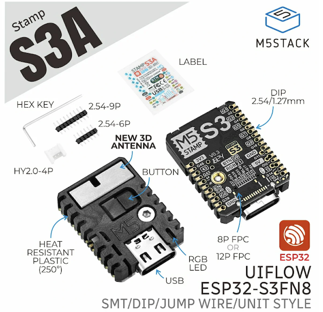

### Appendix 0-4 — ESP32 Logging and Persistence Workflow

ESP32 logging is optional, so can be switched off completely, ESP32
Non-Volatile Storage (NVS): can use two file systems:

- SD Card (SPI): For high-capacity logging.

- LittleFS (Internal Flash): A fail-safe if a SD card is not present.

*The "Batch & Flush" Pattern: *

Continual writing to flash or SD cards is "expensive" in terms of time
and power, instead:

- Data is formatted and appended to a log buffer (a String in RAM)

- To protect the Flash/SD card lifespan and prevent "blocking" the CPU
  during writes:

  - Data is string buffered in RAM rather than writing to the disk every
    second.

  - Triggered Flushing: A block write to storage occurs only when:

    - 30 seconds have elapsed.

    - RAM buffer exceeds 4KB.

    - A "Stop Logging" command is received.


- Protocol: Uses FILE_APPEND to preserve across reboots.

SD cards can be connected to a notebook to get the data, or the ESP32
can be connected to PlatformIO and LittleFS data extracted. Wireless FTP
solutions exist, but not explored here. When connected to PlatformIO,
the following commands have been implemented:

The system accepts real-time control via the Serial Terminal or BLE
Characteristic writes:

- **\[S\] Start/Stop:** Toggles the loggingEnabled flag.

- **\[D\] Dump:** Flushes the buffer and prints the entire CSV log to
  the terminal.

- **\[V\]Dashboard:** Toggles a live "flight instrument" view in the
  serial monitor using \r (carriage return) to update a single line
  without scrolling.

- **\[M\]** show options

> The \[S\] Start/Stop:** **can be executed via BLE. If you stop logging
> via BLE, the loop() logic detects that loggingEnabled is now false and
> flushes the RAM buffer (log buffer) to the storage device. (if used
> from the Garmin headset, a delegate command would be attached to the
> Activity Start/Stop button commands)

### Appendix 0-5 — Handling Two Clocks

Assume the ESP32 sends packets at 4Hz. The Garmin 1 Hz Activity.Info
loop and BLE stream do not natively sync, they run on separate internal
clocks, that is two independent systems:

1.  **BLE Wireless Clock (Asynchronous):** ESP32 code controls this
    clock. Its set 250 milliseconds, (4 Hz, 1/4 second) it fires a data
    packet, the Garmin BLE hardware catches it and runs the function
    onCharacteristicChanged(). This happens completely at random
    relative to what the device is doing.

2.  **App UI Clock (Synchronous):** Garmin Connect IQ virtual machine
    controls this clock. Every 1,000 milliseconds (1 Hz, 1 second), it
    pauses background processes, updates the master Activity.Info object
    with the latest GPS, speed, and power metrics, and executes
    compute(info) function.

Because these cycles are decoupled, the 4 Hz packets will land at
varying times within that 1-second Garmin window. The 4 Hz packets will
be slightly "out of phase" with Garmin's 1 Hz data snapshot.

Timeline (ms): 0ms 250ms 500ms 750ms 1000ms (1 Second)

▼ ▼ ▼ ▼ ▼

ESP32 BLE: \[P1\] \[P2\] \[P3\] \[P4\] \[P5\]...

Garmin App: ──────────────────────────────────────────► \[compute(info)
Loop\]

• Updates speed/power

• Refreshes screen

• Runs math formulas

The Timeline Mapping (The Phase Shift)

tWhen compute(info) triggers on the 1-second mark, it pulls the latest
metrics that Garmin's internal sensor processor has calculated for that
second (e.g., your current power from an ANT+ meter or speed from a hub
sensor). The sync looks like this:

- **0ms:** Garmin updates info variables and runs your compute() loop.

- **210ms:** **Packet 1** arrives from ESP32. (Stores inside your app
  memory).

- **460ms:** **Packet 2** arrives from ESP32. (Stores inside your app
  memory).

- **710ms:** **Packet 3** arrives from ESP32. (Stores inside your app
  memory).

- **960ms:** **Packet 4** arrives from ESP32. (Stores inside your app
  memory).

- **1000ms:** Garmin triggers the next compute(info) loop.

When that 1000ms mark hits, Packet 4 is only 40 milliseconds old, but
Packet 1 is 790 milliseconds old, this creates data skew alignment
error. Two synchronization strategies:

**Strategy A: The Centered Block Average (the one used)**

Assume the average of those 4 packets represents the true environmental
state of that specific elapsed second.

When compute(info) runs, you take the average/sum fo alt diff, of the 4
buffered packets and pair it directly with the single info.currentPower
and info.currentSpeed value. This smooths out the phase shift.

Code snippet

```monkeyc
// Inside compute(info)
if (packetBuffer.size() > 0) {
    var averageSensorValue = calculateBufferAverage(); // Smooths P1, P2, P3, P4
    packetBuffer = []; // Clear buffer for next second

    // Sync achieved: 1-second average vs 1-second Garmin snapshot
    var currentCdA = calculateCdA(
        info.currentPower,
        info.currentSpeed,
        averageSensorValue
    );
}
```

**Strategy B: Time-Stamping via System Clocks (one considered but too
hard - as a note)**

Tag each incoming 4 Hz packet with the exact millisecond it arrived
using Garmin's system timer.

Code snippet

```monkeyc
// Inside BLE callback (runs 4x a second)
function onCharacteristicChanged(characteristic, value) {
    var rawMetric = value.decodeNumber(
        Lang.NUMBER_FORMAT_FLOAT,
        {:offset => 0}
    );
    var arrivalTime = System.getTimer(); // Milliseconds

    // Store the value and the time it arrived
    packetBuffer.add([rawMetric, arrivalTime]);
}
```

When compute(info) fires, look at the timestamps of 4 Hz data to see how
close they were to the 1 Hz execution boundary, allowing data weighting
or discarding packets that arrived too close to the edge of the clock
cycle. Too hard to play with and consumes lots of processing - the
simulator also has trouble.

### Appendix 0-6 — Microcontroller Hardware

All great toys.

#### M5Stamp-S3A

The M5Stamp-S3A supports 2.4 GHz Wi-Fi and Bluetooth 5 (BLE). These are
dual core processors, (Cs are single core, which the code supports). One
core handles sensor, the other manages BLE communications. M5Stamp-S3A
costs around 10 USD.


#### M5Stamp Grove Breakout Board

The expansion board adds a battery holder, and simplifies the connection
of I2C sensors with Grove ports. Around 6 USD.

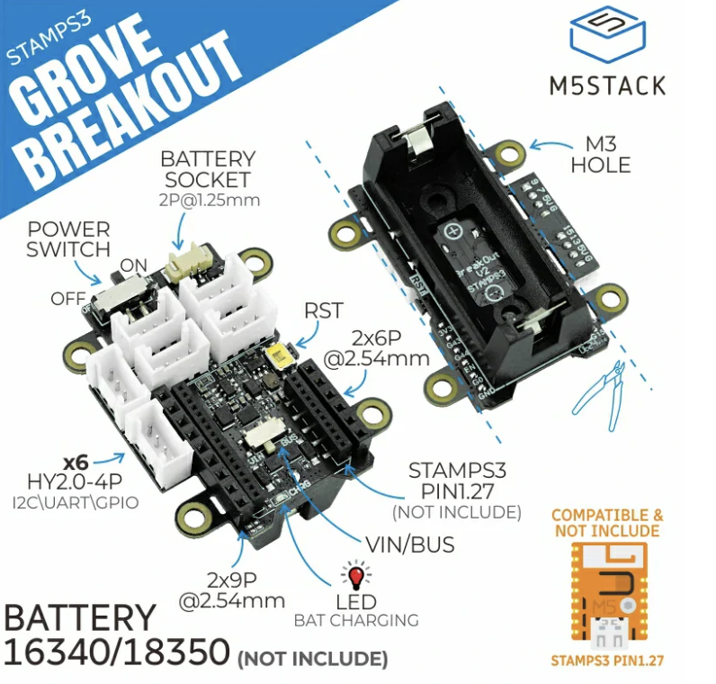

(Only the 16340 fits)

#### M5Stack Capsules

The **M5Stack Capsule** is a pill-shaped development kit built around
the **M5StampS3**. It’s the most suitable for building the home
solution, it would need a 2 I2C adapter, and will minimize all wiring
and control. (Not shown, as mine hasn't arrived

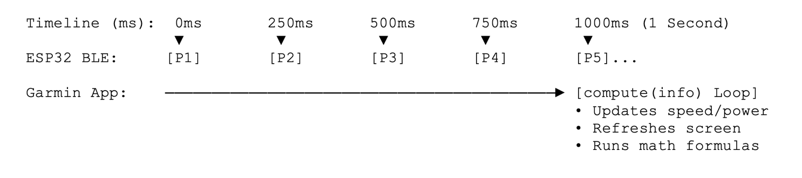

Features:

**Enclosure:** A compact, protective plastic shell that houses the
electronics, making it more durable for outdoor environments.

**Battery & Power:** Has an internal 250mAh lithium battery and built-in
charging circuit.

**Grove Port:** A HY2.0-4P connector to external I2C units, such as I2C
breakout adapter.

**Buttons:** Includes a multi-function button for input and a reset
button accessed through the shell – this saves command programing in
Gramin, e.g.: start/stop logs.

**BMI270:** built in gyroscope and acceleration sensor.

**Timing:** This module has a clock, so debugging output can have actual
time stamps, without a specialized sensor, other solutions time stamp,
is the duration since logging started.
