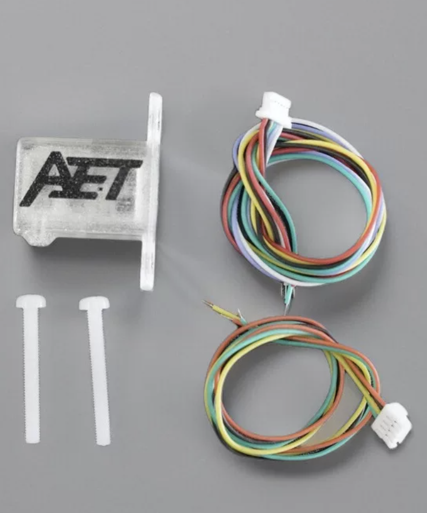

**Calculating Bicycle CdA (Coefficient of Drag Area)**

# Introduction

This document outlines the development of a CdA estimator centered on an ESP32 microcontroller-based sensor hub, integrated with Garmin cycling computers and power-meter data.

The ESP32 sensor hub is the core of the solution. It collects, manages, and processes data from high-precision external sensors required for effective CdA estimation. This helps riders optimize their position and equipment for maximum speed.

Once limited to wind tunnels and expensive specialized equipment, CdA estimation is now accessible through affordable technologies developed for drones and the Internet of Things. Combined with the ESP32’s flexible connectivity and processing capabilities, these technologies make practical, real-time DIY aerodynamic analysis possible.

The solution can operate using basic data from a Garmin head unit, but its full capability comes from higher-precision sensor data managed by the ESP32 hub. It automatically uses the most accurate variables available while retaining Garmin and other less precise data sources as fallbacks.

We solve the real-time *Bicycle Equations of Motion*, because cyclists are flexible bodies on a bike; shifting positions alter both frontal area and shape.  To account for this, we combine the Coefficient of Drag (Cd) and Area (A) into a single metric—CdA


CdA estimation relies on categorizing power consumption components, isolating the drag, then breaking out the CdA. CdA values are saved to the FIT file with standard Garmin metrics. Granular metrics and raw calculations are stored in the external sensor log when connected and configured.

**<u>GARMIN Head Unit</u>**


This is an entertaining programming problem, and an introduction to sensor technologies, I’ve become a fan of the M5Stack (<https://m5stack.com/>) products, easy to understand and connect. The boring or technical bits are in the appendixes.

## **The Power Balance Equation**

All physics models are effective; an effective model intentionally ignores microscopic complexities to describe the macroscopic behavior; it uses insufficient or incomplete details and over simplifications that become invalid in some circumstances - that's the warning.

The CdA estimator uses a physics-based power balance equation to isolate aerodynamic drag from other **power** consuming factors:

``` math
P_{Total} = P_{Drag} + P_{Rolling} + P_{Climb} + P_{Kinetic\ Energy\ \ \ } + P_{Drive\ train\ \ \ }
```

``` math
P_{Total} = \underset{Drag}{\overset{\left\lbrack \frac{1}{2}\rho \cdot CdA \cdot v_{air}^{2} \cdot v_{road} \right\rbrack}{︸}} + \underset{Rolling}{\overset{\left\lbrack C_{rr} \cdot m \cdot g \cdot v_{road} \right\rbrack}{︸}} + \underset{Climb}{\overset{\left\lbrack m\ .g.\ \frac{d}{dt}\nabla A\mathbf{\ }\  \right\rbrack}{︸}} + \underset{Kinetic\ Energy\ }{\overset{\left\lbrack m/2\ .\ \frac{d}{dt}\nabla{v_{road}}^{2}\ \  \right\rbrack}{︸}} + Drive\ Train
```

$`\mathbf{P}_{\mathbf{total\ }}\mathbf{:}`$ Power measured by a meter.

$`\mathbf{Drag}`$ : Power required to overcome air resistance, must be isolated for $`CdA\`$calculation:

$`P_{Drag} =`$ $`\frac{1}{2}\rho \cdot CdA \cdot v_{air}^{2} \cdot v_{road}`$ $`= P_{Total} - \left( P_{Rolling} + P_{Climb} + P_{kinetic\ Energy}\  + P_{Drive\ Train}\  \right)\`$

***Rolling**:* Power consumed by tire rolling resistance, the rubber contact patch deforms and recovers, but doesn't return all the energy used to deform it. The basic formula is: $`\mathbf{C}_{\mathbf{rr}}\mathbf{\cdot}\mathbf{m}\mathbf{\cdot}\mathbf{g}\mathbf{\cdot}\mathbf{v}_{\mathbf{road}}`$ As an effective model simplification, Rolling depends on slope, however, this will be ignored. Clinchers with latex tube $`\mathbf{C}_{\mathbf{rr}}`$ $`\approx \`$<!-- -->0.0035 – 0.0045 at 36 Km/Hr. and 90Kg combined bike rider mass around 35 Watts. $`\mathbf{C}_{\mathbf{rr}}`$ values are available for major tire brands.

***Climb:*** Power consumed or contributed by gravitational potential energy, PE, change rate. $`m\ .g.\ \frac{d}{dt}\nabla Alt`$ where $`\mathbf{\nabla}Alt`$ is the change in altitude. It can be estimated with barometer (or accelerometer) sensors. Small errors are significant, e.g.: 90Kg combined bike rider mass, climbing 0.5 m at 5 m/s (18 km/h), a 10% gradient, would consume 220 Watts alone, much higher contributions are possible in descents. The climb power is a useful standalone metric*.*

***Kinetic Energy:*** Power consumed or contributed by Kinetic Energy, KE, change rate. Power is consumed by going faster, or added by slowing down. Can be calculated as ($`m/2)\ \ .\ \frac{d}{dt}\nabla{v_{road}}^{2}`$ alternatively, $`m\ .\ Acceleration.\ v_{road}`$ . No change in KE indicates a constant velocity. To account for the wheels an INERTIA_FACTOR = 1.04, multiplies mass; to create an effective mass in the KE calculation, this is a simplification.

***Drive Train:*** loss $`\approx \`$<!-- -->2-3% to drive chain friction, (bearing and chain). Represented as 0.025\* $`P_{total}`$ around 5 Watts at 200 Watts power. For the display, Drive train friction and Rolling friction are added and shown as *“Friction”.* Both are constants multiplying the current power. These are both simplifications.

$`\mathbf{\rho}`$ (Air Density)**:** Calculated from barometer/temp/humidity sensors. $`\mathbf{\rho}`$ appears in *Climb,* (estimating altitude changes), and $`Drag`$ calculations, and measured by multiple sensors. In simple form:

> 
> ``` math
> \rho = \frac{P}{R_{specific} \cdot T}
> ```

- **P** (Absolute Pressure): Pascals (Pa).

- $`\mathbf{R}_{\mathbf{specific}}`$ (Gas Constant): For dry air, this is approximately $`287.058\,\text{J/(kg·K)}.`$

- $`\mathbf{T}`$ (Absolute Temperature): Kelvin (K)

> *Notes:*

- 1,000 m elevation gain, reduces air density by about 10%.

- 10C temperature increase reduces air density by about 3%.

- At 30C and 90% humidity, the air density is about 0.6% to 0.8% lower than dry air 0% humidity, resulting in CdA will appear roughly 0.7% lower. Humidity correction not discussed here.

$`\mathbf{v}_{\mathbf{air}}`$ **:** airspeed in direction of travel. Tail winds and yaw are not considered when present, air speed may be under-estimated. Basic sensors have reliable lower reading ranges of roughly 10–15 km/h (3–4 m/s), below 10 km/h, the sensor may drift up randomly even if the bike is still.

$`\mathbf{v}_{\mathbf{road}}`$. Ground speed, the Garmin GPS can be 3 seconds or drop out, so wheel magnet measurements are desirable. (using Speed and Velocity interchangeably here)

$`\mathbf{C}_{\mathbf{rr}}`$ : Coefficient of Rolling Resistance a dimensionless value that estimates tire energy loss; ratio of force required to keep a tire rolling to vertical load (weight).

$`\mathbf{m}`$ : Combined mass of the rider and bicycle, rider mass + bike mass.

$`\mathbf{g}`$ : Earth’s gravity surface acceleration of approximately $`\text{(}9.81\text{ }{\text{m}\text{/}\text{s}}^{2}\text{)}`$

# The Solution

The interface is a Connect IQ Data Field, that operates in two modes:

- Garmin-Only mode using internal sensors, this solution should be regarded as "play only" without real airspeed the estimates unreliable.

- Garmin + Sensor Hub mode fusing measurement from an external Sensor Hub via Bluetooth Low Energy (BLE) messages.

### User Interface


Garmin headsets can’t easily send commands or data to the sensor hub, e.g.: send the defined, wheel circumference or recorded rider mass. However, it’s possible by attaching BLE messages to button presses. (not tested this one).

### CdA Graph

Example test data stream


## Garmin-only

## Garmin’s OS collects raw metrics, processes them in internal filters, and populates a single snapshot structure: the *Activity.Info* object, which is refreshed at once per second (1 Hz). 

Using only the Garmin headset, Garmin's sensor data are combined with the external Power Meter readings, and configuration settings.

- **Dynamic Configuration**: reads settings from Garmin Connect IQ, (e.g.: AVG_Duration, Bike Weight, Body Weight in Profile), that change model's parameters without recompiling.

- **Metrics**:  Buffers are kept for key data for user defined duration:

<!-- -->

- **Altitude Change**

  - Garmin's absolute altitude readings are smoothed by a Kalman filter.

  - Garmin altitude change is processed by an Exponential Moving Average (EMA), where the "responsiveness" of the EMA is calculated dynamically based on user-defined duration - the average in seconds to be reported.

    - Stored in an array of size duration, and avgVerticalSpeedMS calculated by summing over duration, and dividing by duration, this is used in climb power calculation. When sensors are available the value is augmented with sensor data.

<!-- -->

- **Speed**

  - speedAvgMSec uses Simple Moving Average (SMA) for duration

  - currentSpeedSqDiff used to estimate Kinetic Energy power:

    - A Jitter Threshold is applied so likely noise are zeroed out before being stored .

    - currentSpeedSqDiff uses Simple Moving Average (SMA) for duration.

<!-- -->

- Drag factor (speedAirSensorMSec \* speedAirSensorMSec) \* speedMSec with no sensors, speedAirSensorMSec = speedMSec. It uses a Simple Moving Average (SMA) over duration.

<!-- -->

- **Air Density**

  - Info.ambientPressure  and Toybox.SensorHistory is accessed to get latest temperature, these are used to calculate air density.Without Sensor Hub input these data are used in CdA calculations.

<!-- -->

- **Logging:**

  - FIT Recording: CdA values are recorded into the session's FIT file

## Garmin + ESP32 Sensor Hub

The Garmin-only interface with the ESP32 based sensor hub; the key additional sensor is airspeed. Altitude information from pressure sensor is also provided that augments/ enhances Garmin's.

Garmin Connect IQ applications act as Generic Attribute Profile, (GATT), clients only. Message payload is limited to 20 bytes. Peripheral devices, (GATT Servers), must chop any payload into packets and send them sequentially, the Garmin application must rebuild them.

### External sensor connectivity 

- Bluetooth Low Energy, BLE, Management: Scans for specified service UUID. Data is passed as delimited strings and reassembled on the Garmin, the data meaning is positional.

- Garmin *Activity.Info* is refreshed at 1 Hz; messages from sensor hub to Garmin are sent at 250ms, 4 Hz, and used to create a rolling 1 sec, (1 Hz), data average and sum for altitude difference. (Note the C++ and Monkey C parameters must be synchronized). See [Appendix 0‑5 - Handling Two Clocks](#appendix---handling-two-clocks).

The following sensors are supported, using the I2C protocol:

<table style="width:100%;">
<colgroup>
<col style="width: 13%" />
<col style="width: 15%" />
<col style="width: 28%" />
<col style="width: 29%" />
<col style="width: 12%" />
</colgroup>
<thead>
<tr>
<th><strong>Sensor</strong></th>
<th><strong>Measure</strong></th>
<th><strong>Key Features</strong></th>
<th><blockquote>
<p><strong>Main Purpose in CdA Solution</strong></p>
</blockquote></th>
<th><strong>Approx. Cost (USD)</strong></th>
</tr>
<tr>
<th>MS4525DO</th>
<th><blockquote>
<p>Airspeed</p>
</blockquote></th>
<th style="text-align: left;"><blockquote>
<p>Differential pressure, 14-bit resolution, I2C interface, low power.</p>
</blockquote></th>
<th><blockquote>
<p>Airspeed: Measures the difference between Pitot and Static pressure.</p>
</blockquote></th>
<th>$25 - $40</th>
</tr>
<tr>
<th>(DHT20 + BMP280)</th>
<th><blockquote>
<p>Pressure</p>
<p>+</p>
<p>Temp</p>
<p>+</p>
<p>Air Density</p>
</blockquote></th>
<th style="text-align: left;"><blockquote>
<p>Combined Humidity (DHT20) and Barometric Pressure/Temp (BMP280).</p>
</blockquote></th>
<th><blockquote>
<p>Estimate altitude and air density</p>
</blockquote></th>
<th>$4 - $8</th>
</tr>
<tr>
<th>BMP390</th>
<th><blockquote>
<p>Pressure</p>
<p>+</p>
<p>Temp</p>
<p>+</p>
<p>Air Density</p>
</blockquote></th>
<th style="text-align: left;"><blockquote>
<p>High-precision 24-bit pressure, very low noise, high stability.</p>
</blockquote></th>
<th><blockquote>
<p>Estimate altitude and air density</p>
</blockquote></th>
<th>$10 - $15</th>
</tr>
<tr>
<th><em>Power Meter</em></th>
<th><blockquote>
<p>Power</p>
</blockquote></th>
<th style="text-align: left;"><blockquote>
<p>Single or dual sided provides wattage, and other metrics</p>
</blockquote></th>
<th><blockquote>
<p>Estimate total power being out into system by rider</p>
</blockquote></th>
<th>$200...$1000</th>
</tr>
<tr>
<th><em>Wheel Speed Magnet</em></th>
<th><blockquote>
<p>Ground speed, directly number of rotations</p>
</blockquote></th>
<th style="text-align: left;"><blockquote>
<p>Accurate road speed. GPS is unreliable in short time scales</p>
</blockquote></th>
<th><blockquote>
<p>Read by headset Garmin uses in preference to GPS when present. Consumption by microcontroller with BLE, is for addition metrics and debugging.</p>
</blockquote></th>
<th>$15...$30</th>
</tr>
</thead>
<tbody>
</tbody>
</table>

Note: Power Meters and Wheel Magnet Sensors support both ANT+ and BLE, See [Appendix 0‑3 Sensor Details](#appendix-03-sensor-details) for the hub sensor options

#### Other sensors considered

##### Acceleration Sensor

To provide additional validation data:

- Climb rate: detects changes $`(\Delta\, Valt)`$ in the direction of gravity, can be used as an additional source for altitude gain.

- KE detects changes $`(\Delta\, Vroad)`$ in the direction of travel, alternative form of calculation $`P_{KE}`$ = m.a. $`v_{road}`$

##### Lidar Time of Flight (ToF) or Similar

Integrating a rear-facing, handlebar-mounted micro-LiDAR /Tof camera could create an automated Aerodynamic Position Classifier. Instead of treating the rider's shape, the sensors combine with machine learning models could match distinct geometric postures directly to their corresponding real-time drag values. Collected data could train a model, which is then used as classifier for good positions, the VL53L5CX has been tested and discussed in Appendix. An AI camera with depth perception is also an option. Logging on SD is mandatory with these approaches.


**\**

### 

### **Logical Relationship between Garmin and Sensor Hub**


## **Sensor Hub**

Sensor Hub is based the ESP32-S3, a dual-core architecture micro controller. Sensor sampling, and communication and storage tasks, can be decoupled. See [Appendix 0‑6 - Micro Controller Hardware](#appendix---micro-controller-hardware).

Below is the ESP32-S3 workflow:

### **ESP32-S3 Boot Sequence**

> **Hardware Stabilization:** A 2-second delay when connected.
>
> **Storage Mounting:** If ESP logging set, attempts to mount persistent storage.

**Bus Integrity:** Performs a bit-bang test on I2C pins to check for stuck lines or missing pull-ups before initializing the Wire bus at 100kHz.

> **Sensor Discovery:** Scans the I2C bus for the MS4525DO Airspeed sensor and the BMP390/280/ AHT20 sensors, and others if added.
>
> **Calibration:** 

- Samples the air for zero-pressure offsets for airspeed.

- Ground-level pressure (for altitude reference), and other if present.

> **Task Launching:**

- Sensor Acquisition Workflow - sensor Task on Core 0

- Aggregation and Telemetry Workflow - loop () on Core 1

> The design assumes dual-core, it was written to also work on a single core, without queuing but not fully tested.

### **High-Frequency Acquisition Workflow (sensor Task on Core 0)**

This task handles the sensor reads:

> **Sampling:** Sampling is set by sensor, e.g.: 50 milli second 20 Hz.
>
> **Smoothing:** 

- Airspeed raw data is passed through a** **Kalman Filter** **

- Altitude uses an Exponential Moving Average (EMA to remove noise.)

- Density rolling average calculated

> **Queueing:**  values are put on the Sensor Queue. this decouples high-speed sensing from slower transmission and logging tasks.

### **Aggregation and Telemetry Workflow (loop () on Core 1)**

Runs the aggregation, logging and transmission:

> **Drain Queue:**

- Create rolling average for point samples, e.g.: airspeed, air density, others

- Calculate accumulated altitude change (Climb/Descent) by comparing consecutive Altitudes, it uses the last sample from previous BLE_PUBLISH_INTERVAL as the starting point to avoid jumping, a 5cm dead zone is applied.

> **External Sensor Sync:** Collects data from external sensors e.g.: Power Meter, Wheel Road speed magnet, this could allow, the hub to bypass the Garmin headset completely, using a display, or publish to website.
>
> *Ground Speed*: acts as a BLE Client to a remote cycling speed sensor, calculating ground speed based on wheel revolutions (implemented but not used - testing too much hassle, originally considered passing the complete calculation to Garmin, so it would become only a display unit.)
>
> **Formatting:** A subset of data are formatted into a pipe-delimited, "\|", string, terminated by "\*". Garmin logic is required to handle deformed BLE messages, as they can "go missing".

### **Logging and Persistence Workflow:** ESP32 logging is optional. ESP32 Non-Volatile Storage (NVS), can use two file systems:

- Secure Digital SD Card (SPI):  high-capacity logging.

- LittleFS (Internal Flash):  if a SD card is not present; this is useful in development.

> For local logging HH:MM: SS\|Data\| is added for all data items. Standard ESP32 records elapsed time from session start, not actual time, which would require a timing chip.
>
> This log provides additional analysis, it's available in the development environment and can be downloaded from a SD card.
>
> When connected to the development Serial Monitor a command menu is available:

<table style="width:57%;">
<colgroup>
<col style="width: 56%" />
</colgroup>
<thead>
<tr>
<th style="text-align: left;"><blockquote>
<p>--- Operational Commands ---</p>
<p>[S] - Toggle Logging (Start/Stop)</p>
<p>[D] - Flush Buffer &amp; Dump Log File</p>
<p>[I] - Show Storage &amp; File Status</p>
<p>[C] - Clear/Delete Log File</p>
<p>[H] - Halt System (Stop all tasks)</p>
<p>[V] - Toggle Dashboard View</p>
<p>[M] - Show this Menu again</p>
</blockquote></th>
</tr>
</thead>
<tbody>
</tbody>
</table>

> **Transmission**
>
> Messages are chunked and transmitted.

### **Sensor Hub Logical Flow**

> 

Ground speed is received by Sensor Hub, but not used on the M5Stack, power meter data could also be used, thereby providing a standalone option. There is the potential to calculate the whole drag component on the ESP32, if wheel size is added via a UI (e.g., using the M5Stick)

### Sensor Fusion

Sensor fusion combines data from multiple sensors to get result that is more accurate/reliable, than a single sensor. Sensors operate with different accuracy, potentially measuring complementary observables. The "fusion" of sensor result can produce more accurate overall measurements. Fusion uses smoothing and Kalman filters, (see Internet for many explanations), provide the best results. Some sensor combinations:

<table>
<colgroup>
<col style="width: 26%" />
<col style="width: 12%" />
<col style="width: 60%" />
</colgroup>
<thead>
<tr>
<th><strong>Fusion</strong></th>
<th><strong>Output</strong></th>
<th><strong>Usage in CdA Model</strong></th>
</tr>
</thead>
<tbody>
<tr>
<td><p>MS4525DO</p>
<p>+</p>
<p>BMP390</p></td>
<td>Airspeed</td>
<td><blockquote>
<p>BMP390 used to estimate pressure for altitude and temperature for air density calculation</p>
<p>MS4525DO falls back to air density constant and internal temperature</p>
</blockquote></td>
</tr>
<tr>
<td><p>MS4525DO</p>
<p>+</p>
<p>(DHT20 + BMP280)</p></td>
<td>Airspeed</td>
<td><blockquote>
<p>BMP280 used to estimate pressure for altitude and temperature for air density calculation</p>
<p>MS4525DO falls back to air density constant and internal temp.</p>
<p>DHT20 when available is used for all temperature calculations as more accurate than the BMPXXX.</p>
</blockquote></td>
</tr>
<tr>
<td><p>((DHT20 + BMP280)</p>
<p>or</p>
<p>BMP390)</p>
<p>+</p>
<p>Garmin Altitude change</p></td>
<td>Altitude change</td>
<td><blockquote>
<p><strong>Complementary Filter</strong> uses a weighted average :</p>
</blockquote>
<ul>
<li><p>90% Trust is given to the external sensor's change in height external BMP sensor is present</p></li>
<li><p>10% Trust is given to the Garmin's rolling duration altitude trend.</p></li>
<li><p>The Fallback<strong>:</strong> If the external BMP sensor data is null, the system trusts the Garmin duration-second trend 100%.</p></li>
</ul></td>
</tr>
<tr>
<td><p>BMP390</p>
<p>or</p>
<p>(DHT20 + BMP280)</p></td>
<td>Air Density</td>
<td><blockquote>
<p>Overides Garmin calculation</p>
</blockquote></td>
</tr>
</tbody>
</table>

Accelerometer can be used to add accuracy in Kinetic energy calculations and Altitude change, these are both second order in time, and not is the current Git code, as both need more testing.

## Sensor Placement

Use these criteria:

- Pitot tube must not be is the wash of the front wheel.

- Pitot tube must not be so close to the frame and rider, that rider position changes, (which we are analyzing), alters the airflow around the sensor.

- The stem to should be rigid enough that its movements are not generating its own airflow.

- The pressure sensor should not be in direct sunlight.

- If using the accelerometers its position must be stable on the bike.

## **Physical Design ESP32**

The Grove standard uses the following, note M5 allows redefinition of GPIOs:

### Pin 1 SCL YellowSerial Clock line for timing synchronization.

### Pin 2 SDA White Serial Data line for sending/receiving.

### Pin 3 VCC Red Power supply (typically dual-compatible with 3.3V or 5V).

### Pin 4 GND Black Common ground reference.

Pin order matters, as sensors use different JST SH /GH pin standards, and others, which have different pin order, plug sizes and pitches.


## Working Prototypes

Two prototypes below, its possible to make more streamlined solutions, (using the M5Stamp Capsule would simpliify wiring - not arrived in time). A better would be to M5 Stick used for data input and monitoring the power meter, (via BLE), and wheel magnet, (implemented but not used in ESP32 calculations). With an M5Stick the Garmin headset could be replaced, the downside would be the loss of correlation with other cycling metrics.

<table style="width:97%;">
<colgroup>
<col style="width: 49%" />
<col style="width: 47%" />
</colgroup>
<thead>
<tr>
<th><p>M5Stamp on Grove breakout using wing Airspeed sensor, BMP280 and Accel; breakout has a built in battery unit.</p>
<p></p></th>
<th>M5Stamp using airspeed sensor with external Pitot tube and BMP390, needs external battery unit.</th>
</tr>
</thead>
<tbody>
</tbody>
</table>

# Appendices

## Appendix ‑ Accounting for Rolling Mass

To account for wheel inertia, the total kinetic energy should include translational and rotational components, as all acceleration consumes energy:

- Linear Kinetic Energy: depends on the total mass (m) and velocity (v).

- Rotational Kinetic Energy: depends on spinning the wheels (moment of inertia I) at angular velocity $`\omega`$

For a bicycle wheel, the effective "rotational mass" is roughly equal to the actual mass of the wheel, the Rule of Thumb: 1 kg of wheel weighs 2 kg when accelerating.

### *Effective Mass*

For CdA calculation use Effective Mass $`m_{eff}\`$instead of static mass, this allows kinetic energy formula: $`P_{kinetic} = m_{eff} \cdot a \cdot v`$ where $`m_{eff}`$ is: $`m_{eff} = m_{total} + \frac{\sum I}{r^{2}}`$

- $`\mathbf{m}_{\mathbf{total}}`$: Rider + Bike + Gear.

- $`\mathbf{I}:`$ Moment of inertia of the wheels.

- **r**: Radius of the wheel (approx. 0.335m for 700c).

### *Estimating "I"* 

The I value changes between a climbing wheel and a disc wheel.

| **Wheel Type** | **Approx. Inertia (I)** | **I/r2 (Add-on Mass)** | **Total "Inertial Penalty"** |
|----|----|----|----|
| Light Climbing Wheel | 
``` math
\approx 0.10\ kg \cdot m^{2}
``` | 1.6 kg | approx. 1.8 kg per pair |
| Deep Section (80mm) | 
``` math
\approx 0.14\ kg\ m^{2}
``` | 1.2 kg | approx 2.4 kg per pair) |
| Rear Disc Wheel | 
``` math
\approx 0.18\ kg\ m^{2}
``` | 1.6 kg | approx 3.2 kg (rear only) |

### *Implementation in CdA Calculation*

In the Monkey C code, a Moment of Inertia Factor INERTIA_FACTOR for 700c wheels, this factor is roughly 1.03 to 1.05. $`m_{eff} = m_{total} \cdot {INERTIA\_ FACTOR\ }_{i}\ \ .\`$ INERTIA_FACTOR = 1.04, is used.

## Appendix ‑ Development Environments

### Garmin Monkey C Development: VS Code + Connect IQ (CIQ) SDK

Use a standard install.

To work with BLE the Garmin Simulator needs the Nordic nRF52-DK or nRF52840 Dongle, and associated software. Practically the dongle is the cheapest/simplest solution. Read Garmin's install docs. Flashing the dongle may require going back a few versions to get it working

Referencing BLE in anyway in simulator code without a dongle, will bring the simulator down, these errors can't be trapped in Try/Catch, (at least the mac). If coding/testing without BLE the relevant code must be by-passed. The following parameters in the CdA_Utilities.mc are relevant to development.

const DEBUG = true;

const BLE_DEBUG = true;

var USING_SENSOR = true;

const TESTING_WITH_FAN = true;

DEBUG -- Prints contents if DEBUG print lines

BLE_DEBUG - Prints contents if DEBUG in BLE connection area

USING_SENSOR -- When "false" all code connecting to BLE is bypassed.

TESTING_WITH_FAN -- When "true" assume simulation data generated or a FIT file is being played, with connected airspeed sensor that's pointed at a fan, the value of Air Speed used in the application becomes the ((ground speed from FIT file/Sim) + Sensor Input); this gives a more realistic simulation.

### ESP32 development: VS Code + PlatformIO

The code is all built with PlatformIO for the ESP32 development – with something else, then some playing around with the configuration file will be required.

## Appendix 0‑3 Sensor Details

All sensors used, follow Inter-Integrated Circuit, **I**2C standard, *I-squared-C*, a synchronous, multi-device communication protocol used to connect peripherals to microcontrollers. It uses:

- *SDA (Serial Data):* send and receive data bits.

- *SCL (Serial Clock):* clock signal generated by the master device to synchronize the timing of the data transfer.

Sensors supporting I2C will have these pins, but the order and connector sizes are not standard:

- Grove standard 2.0mm pitch connector, also called HY2.0 - with buckle.

- Qwiic and STEMMA QT standard uses 4-pin JST SH connector with a 1.0mm pitch, the VCC pin always needs checking

- 1.25mm pitch JST 4-pin connector

All connections need checking, convertors are not generic as pin layouts change, (hint: stay Grove, when possible). Wire splicing is the solution, unless you want to buy 1000 connectors on Alibaba.

### **Airspeed Sensor MS4525DO** 

A pitot-static tube measures velocity by comparing total pressure with static pressure.

- Total Pressure: front-facing opening that points directly into the wind. As the bike moves, the air converts its kinetic energy into pressure.

- Static Pressure: small holes located perpendicular to the airflow measure the ambient atmospheric pressure without the influence of the bike's forward movement.

$`v_{air} = \sqrt{\frac{2{(P}_{total} - P_{static)}\ \ }{\rho}}`$

Note the importance of $`\mathbf{\rho}`$ (Air Density)**,** its used in both the $`\mathbf{v}_{\mathbf{air}}`$ calculation and the drag calculation.

The MS4525DO is a differential pressure I2C sensor, show in two form factors below:

|  |  |
|----|----|

### **Altitude sensors AHT20+ BMP280**

AHT20 + BMP280 module is a I2C sensor board providing temperature, humidity, and atmospheric pressure data. It has the AHT20 (humidity/temp) and BMP280 (pressure/temp). Theoretical Sensitivity Limit of approx 11cm, practical 1m. The AHT20 provides temperature accuracy $`\left( \text{(} \pm \,{0.3}^{\circ}C\text{)} \right)`$ compared to the BMP280$`\ (\text{(} \pm 0.5C\text{)}\`$to $`\text{(±1C)).}`$

|  |  |
|----|----|

### **Altitude sensors BMP390**

BMP390 is the upgrade to the BMP280. Comparing the BMP390 and BMP280:

- Theoretical Sensitivity Limit of approx 1.7cm practical 0.25m (This is the most important benefit of this sensor)

- BMP390 and BMP280 are not pin-to-pin compatible and use different addresses.

> 

BMP390 measures temperature for internal compensation, this calibrated temperature data published via the I2C. Accuracy of $`\pm 0.5C`$ and 0.005 resolution, so $`\pm 0.2C`$ less accurate than the AHT20.

### Accelerometer + Gyroscope (hypothetical - in test only)

ACCEL is a motion sensor.. With ADXL 345 and ACC, 3-axis speed can be derived.

- 3-Axis Measurement: Measures acceleration in the X, Y, and Z directions.

- Sensitivity: Measures up to ± 16g with high 13-bit resolution, can detect tilt changes of less than 1.0°.

- Digital Outputs: 16-bit output.

- Communication: I2C or SPI communication protocols.

- Special Features: Includes built-in motion sensing, such as detecting tap/double-tap events, general activity, and inactivity


I've tested 1 US accelerometer product; the results are compatible with checking the delta velocities.

The M5Stack Capsule (ESP32) has BMI270 is a 6-axis Inertial Measurement Unit (IMU), It combines a 3-axis Accelerometer and a 3-axis Gyroscope

#### Lidar, ToF or AI camera

The VL53L5CX is a time-of-flight (ToF) multi-area sensor, and can measure precise distances regardless of target color and reflectivity. It provides an accurate range of up to 400 cm and operates at high speeds (60 Hz.



The multi-spatial distance measurement system can achieve an area of ​​up to 8x8, 63° wide field of view, which can be reduced with software. The VL53L5CX can detect various objects within its field of view using STF Semiconductor's patented histogram algorithm. The histogram algorithm can also suppress crosstalk of cover slides exceeding 60 cm.


SPAD: Single-Photon Avalanche Diode

- Solid-state photodetector. It acts like a digital light switch it can detect and count individual light particles (photons).

- SPADs are used in time-of-flight cameras and LiDAR.

- **kcps/spads** stands for **kilo counts per second per SPAD**, which is a unit of measurement used to quantify light signal strength in advanced photon-detecting and ranging sensors.

Reading the output table Output

Line 1. distance in mm

Line 2. ambient noise kcps/spads, no of valid targets detected, no spads, no spads enabled for range

Line 3. Signal returned to sensor kcps/spads,estimated reflectance in %, Target status (5,9 is ok).

The Sipeed A010 TOF camera has also be tested, this has a 100X100 output and costs around 40US. It doesn't use SPAD but an interference mechanism and valid to 2.5 metres, this is probably the best sensor solution for body position monitoring:

|  |  |
|----|----|

## 

## 

## Appendix 0‑4 ESP32 Logging and Persistence Workflow

ESP32 logging is optional, so can be switched off completely, ESP32 Non-Volatile Storage (NVS): can use two file systems:

- SD Card (SPI): For high-capacity logging.

- LittleFS (Internal Flash): A fail-safe if a SD card is not present.

*The "Batch & Flush" Pattern: *

Continual writing to flash or SD cards is "expensive" in terms of time and power, instead:

- Data is formatted and appended to a log buffer (a String in RAM)

- To protect the Flash/SD card lifespan and prevent "blocking" the CPU during writes:

  - Data is string buffered in RAM rather than writing to the disk every second.

  - Triggered Flushing: A block write to storage occurs only when:

    - 30 seconds have elapsed.

    - RAM buffer exceeds 4KB.

    - A "Stop Logging" command is received.

<!-- -->

- Protocol: Uses FILE_APPEND to preserve across reboots.

SD cards can be connected to a notebook to get the data, or the ESP32 can be connected to PlatformIO and LittleFS data extracted. Wireless FTP solutions exist, but not explored here. When connected to PlatformIO, the following commands have been implemented:

The system accepts real-time control via the Serial Terminal or BLE Characteristic writes:

- **\[S\] Start/Stop:** Toggles the loggingEnabled flag.

- **\[D\] Dump:** Flushes the buffer and prints the entire CSV log to the terminal.

- **\[V\]Dashboard:** Toggles a live "flight instrument" view in the serial monitor using \r (carriage return) to update a single line without scrolling.

- **\[M\]** show options

> The \[S\] Start/Stop:** **can be executed via BLE. If you stop logging via BLE, the loop() logic detects that loggingEnabled is now false and flushes the RAM buffer (log buffer) to the storage device. (if used from the Garmin headset, a delegate command would be attached to the Activity Start/Stop button commands)

## Appendix ‑ - Handling Two Clocks

Assume the ESP32 sends packets at 4Hz. The Garmin 1 Hz Activity.Info loop and BLE stream do not natuarally sync, they run on separate internal clocks, that is two independent systems:

1.  **BLE Wireless Clock (Asynchronous):** ESP32 code controls the interval time - ESP32 don't an internal clock. Interval is set tp 250 milliseconds, (4 Hz, 1/4 second) it fires a data packet, the Garmin BLE hardware catches it and runs the function onCharacteristicChanged(). This happens completely at random relative to what the device is doing.

2.  **App UI Clock (Synchronous):** Garmin Connect IQ virtual machine controls this clock. Every 1,000 milliseconds (1 Hz, 1 second), it pauses background processes, updates the master Activity.Info object with the latest GPS, speed, and power metrics, and executes compute(info) function.

Because these cycles are decoupled, the 4 Hz packets will land at varying times within that 1-second Garmin window. In a perfect "unlikely" world the situation would be:


The Timeline Mapping (The Phase Shift)

In all cases, 4 Hz packets will be "out of phase" with Garmin's 1 HZ sensor data, note the Garmin works a 1HZ, sensors could operate at much higher sampling rates; 4 Hz is the publishing rate for Sensor Hub BLE, the actual sensor read rates are higher.

**Strategy A: The Centered Block Average (the one used)**

Assume the average of those 4 packets represents the true sensor's state for that Garmin elapsed second. When compute(info) runs, take the average/sum of the 4 BLE buffered packets and pair them directly with the single info.currentPower, info.currenitSpeed altitude change values. This smooths the differences within the 1Hz Garmin cycle.

**Strategy B: Time-Stamping via System Clocks (one considered but too hard - as a note)**

Tag each incoming 4 Hz packet with the exact millisecond it arrived using Garmin's system timer. When compute(info) fires, look at the timestamps of 4 Hz data to see how close they were to the 1 Hz execution boundary, allowing data weighting or discarding packets that arrived too close to the edge of the clock cycle. Too hard to play with and consumes lots of processing - the simulator also has trouble to get this working.

## Appendix ‑ - Micro Controller Hardware

All great toys.

### M5Stamp-S3A

The M5Stamp-S3A supports 2.4 GHz Wi-Fi and Bluetooth 5 (BLE). These are dual core processors, (Cs are single core, which the code supports). One core handles sensor, the other manages BLE communications. M5Stamp-S3A costs around 10 USD.


### 

### M5Stamp Grove Breakout Board

The expansion board adds a battery holder, and simplifies the connection of I2C sensors with Grove ports. Around 6 USD.


(Only the 16340 fits)

### M5Stack Capsules

The **M5Stack Capsule** is a pill-shaped development kit built around the **M5StampS3**. It’s the most suitable for building the home solution, it would need a 2 I2C adapter, and will minimize all wiring and control. (Not shown, as mine hasn't arrived


Features:

**Enclosure:** A compact, protective plastic shell that houses the electronics, making it more durable for outdoor environments.

**Battery & Power:** Has an internal 250mAh lithium battery and built-in charging circuit.

**Grove Port:** A HY2.0-4P connector to external I2C units, such as I2C breakout adapter.

**Buttons:** Includes a multi-function button for input and a reset button accessed through the shell – this saves command programing in Gramin, e.g.: start/stop logs.

**BMI270:** built in gyroscope and acceleration sensor.

**Timing:** This module has a clock, so debugging output can have actual time stamps, without a specialized sensor, other solutions time stamp, is the duration since logging started.
