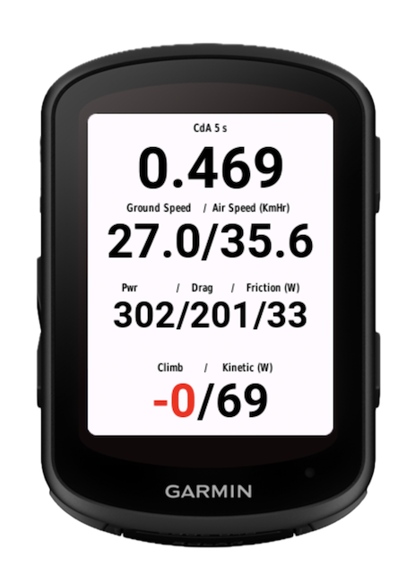

**Calculating Coeffient of Drag Cd Area on Bicycle**

# Introduction

This document covers building a **CdA (Cefficient of Aerodynamic Drag
Area)** estimator for Garmin Edge bicycle computers with power meters.
This solution scales from basic Garmin headset data to high-precision
external sensors. It automatically uses the most accurate variables
available, with built-in fallbacks for less reliable data sources.

The CdA estimator helps riders optimize their position and equipment for
maximum speed with minimum effort. Once restricted to wind tunnels or
expensive specialized sensors, low-cost technology now enables DIY
solutions that provide continuous feedback. While not as precise as a
wind tunnel, these tools offer a practical way to refine performance in
real-time.\"

CdA estimation relies on calculated power usage areas, enabling riders
to test positions and monitor changes via their head unit. Final CdA
values are saved to the FIT file with standard Garmin metrics, while
granular metrics and raw calculations are stored in the external sensor
log.

[GARMIN Head Unit]{.underline}

{width="3.5541666666666667in"
height="3.9405938320209972in"}

 

The document has the sections:

- The Physics of the Problem

- Garmin Headset only Solution

- Sensor and Microcontroller based Solution

This is an entertaining programming problem, and an introduction to
sensor technologies, I've become a fan of the M5Stack
(<https://m5stack.com/>) products, easy to understand and connect. The
boring or very technical bits are in the appendixes.

## The Physics: The Power Balance Equation

We need to solve the ***Bicycle Equations of Motion*** in real-time.
Cyclists are a bag of meat on a bike, position changes impact the area,
so the Cd, and Area must be taken together, unlike other forms of
modeling where a model can be tested and the area scaled.

The power consumption equation:

$$P_{total} = P_{air} + P_{rolling} + P_{gravity} + P_{acceleration}$$

$$P_{total} = \underset{Drag}{\overset{\left\lbrack \frac{1}{2}\rho \cdot CdA \cdot v_{air}^{2} \cdot v_{road} \right\rbrack}{︸}} + \underset{Rolling}{\overset{\left\lbrack C_{rr} \cdot m \cdot g \cdot v_{road} \right\rbrack}{︸}} + \underset{Climb}{\overset{\left\lbrack m \cdot g \cdot \sin(\theta) \cdot v_{road} \right\rbrack}{︸}} + \underset{Accel}{\overset{\left\lbrack m \cdot a \cdot v_{road} \right\rbrack}{︸}}$$

[Variables]{.underline}

$\mathbf{\rho}$ (Air Density)**:** Calculated from
barometer/temp/humidity sensors. $\mathbf{\rho}$ appears in
$\mathbf{v}_{\mathbf{air}}$ and $\mathbf{Drag}$ calculations, and
estimated by multiple sensors, simple equation form:

$$\rho = \frac{P}{R_{specific} \cdot T}$$

- **P** (Absolute Pressure): Measured in Pascals (Pa)..

- $\mathbf{R}_{\mathbf{specific}}$ (Gas Constant): For dry air, this is
  approximately $287.058\,\text{J/(kg·K)}.$

- $\mathbf{T}$ (Absolute Temperature): Measured in Kelvin (K). Convert
  Celsius to Kelvin by adding 273.15 to sensor readings.

> *Notes:*

- For 1,000 meters of elevation gain, air density drops by about 10%.

- A 10C increase in temperature reduces air density by about 3%.

- At 30C and 90% humidity, the air density is about 0.6% to 0.8% lower
  than dry air 0% humidity, resulting in CdA will appearing roughly 0.7%
  lower. Humidity correction not discussed here.

$\mathbf{v}_{\mathbf{air}}$ **:** Bicycle absolute velocity in direction
of travel - airspeed. Tail winds and yaw are not considered when
present, air speed maybe underestimated. Drone sensors have reliable
lower reading ranges of roughly 10--15 km/h (3--4 m/s), below 10 km/h,
the sensor may drift up randomly even while the bike is still.

$\mathbf{v}_{\mathbf{road}}$. Bicycle ground speed. The Garmin GPS can
be 3 seconds or drop out, so a wheel magnet measurements are desirable.

$\mathbf{C}_{\mathbf{rr}}$ : Coefficient of Rolling Resistence a
dimensionless value that estimates rolling tyre energy loss; the ratio
of force required to keep a tire rolling to vertical load (weight).

$\mathbf{m}$ : Combined mass of the rider and bicycle, your mass + bike
mass.

$\mathbf{g}$ : Earth's gravity surface acceleration of approximately
$\text{(}9.81\text{ }{\text{m}\text{/}\text{s}}^{2}\text{)}$

$\mathbf{a}\ :\$ ${\mathbf{d}\mathbf{v}}_{\mathbf{road}}\mathbf{/dt}$
Acceleration of bicycle can be +ve or -ve, this is connected to the rate
of change of Kinetic Energy -- KE. It can consume power by going faster,
or added by slowing down.

$\mathbf{\theta}$ (Slope): The slope angle of the road, at low values
degrees and radian give similar results. The formula
$\sin(\theta) \cdot v_{road}\ is\$a surrogate for the rate of altitude
change. Used to estimate the rate of change of potential energy, which
is power consumed or added from going up or down hills.

$\mathbf{P}_{\mathbf{total}}\mathbf{:}$ Power at pedals; there is loss
is about **2-3%** to drive chain friction, (bearing and chain).
Represented as 0.025\* $P_{total}$ - 5 Watts at 200 Watts power. For the
display, Drive train friction and Rolling friction are added and shown
as ***"Friction"*** these are fixed numbers \* the current power.

$\mathbf{Drag}$ : Power required to overcome wind resistance, must be
isolated for $CdA\$calculation.

$\frac{1}{2}\rho \cdot CdA \cdot v_{air}^{2} \cdot v_{road}$

$$P_{air} = P_{total} - \left( P_{rolling} + P_{gravity} + P_{acceleration} \right)$$

***Rolling**:* Power consumed by rolling resistance. On rotating tyres,
the contact patch deforms and recovers. Rubber doesn\'t return all the
energy used to deform it. The simple formula is:
$\mathbf{C}_{\mathbf{rr}}\mathbf{\cdot}\mathbf{m}\mathbf{\cdot}\mathbf{g}\mathbf{\cdot}\mathbf{v}_{\mathbf{road}}$
Formally, this should be adjusted for the slope, however, this will be
ignored in these calculations. High-quality clincher with latex tube
0.0035 -- 0.0045 at 36 Km/Hr and 90Kg combined bike rider mass around 35
Watts. $\mathbf{C}_{\mathbf{rr}}$ values are available for major tyre
brands.

***Climb** :* The rate of change is gravitational potential energy
consumes or contributes power - going down hill without pedaling. A
simple model is
$\mathbf{m\ .g.\ }\frac{\mathbf{d}}{\mathbf{dt}}\mathbf{\nabla A}$ where
$\mathbf{\nabla A}$ is the change in altitude. $\mathbf{\nabla A}$ can
be estimated with barometer/gyroscope sensors,
$\sin(\theta) \cdot v_{road}$ is equivolent to
$\frac{\mathbf{d}}{\mathbf{dt}}\mathbf{\nabla A}$ Small errors throw the
whole calculation off, e.g.: 90Kg combined bike rider mass, climbing 0.5
m at 5 m/s (18 km/h), a 10% gradient, would consume 220 Watts alone,
much higher contributions are possible in decents, so accuracy is
important. *The climb power is a useful standalone metric.*

## 

## Garmin Headset only Solution

## 

## 

## Sensor and Microcontroller based Solution

Sensors connect to an ESP32 microcontroller, which communicates with the
Garmin head unit via Bluetooth Low Energy (BLE). While all sensors
support the I2C protocol, their pin orders and plug sizes may differ
from the Grove standard, SCL (Clock) SDA (Data) VCC (Voltage),GRD
(Ground), lines requiring some rewiring. When possible, use latchless
Grove connectors.

### Sensor Candidates

+------------+----------------------+-----------------------+---------------+
| **Sensor** | **Key Features**     | > **Main Purpose in   | **Approx.     |
|            |                      | > CdA Solution**      | Cost (USD)**  |
+============+======================+=======================+===============+
| MS4525DO   | Differential         | > Airspeed: Measures  | \$25 - \$40   |
|            | pressure, 14-bit     | > the difference      |               |
|            | resolution, I2C      | > between Pitot and   |               |
|            | interface, low       | > Static pressure.    |               |
|            | power.               |                       |               |
+------------+----------------------+-----------------------+---------------+
| DHT20 +    | Combined Humidity    | > Basic Density:      | \$4 - \$8     |
| BMP280     | (DHT20) and          | > Calculates air      |               |
|            | Barometric           | > density (ρ) with    |               |
|            | Pressure/Temp        | > standard accuracy.  |               |
|            | (BMP280).            |                       |               |
+------------+----------------------+-----------------------+---------------+
| BMP390     | High-precision       | > Advanced Density:   | \$10 - \$15   |
|            | 24-bit pressure,     | > Precise altitude    |               |
|            | very low noise, high | > and density         |               |
|            | stability.           | > tracking (best for  |               |
|            |                      | > climb rates).       |               |
+------------+----------------------+-----------------------+---------------+
| BMI270     | 6-axis IMU[^1]       | > Kinetic Energy:     | \$3 - \$6     |
|            | (Accel + Gyro),      | > Measures            |               |
|            | ultra-low power,     | > slope/gradient and  |               |
|            | built-in \"smart\"   | > forward             |               |
|            | features.            | > acceleration (a).   |               |
+------------+----------------------+-----------------------+---------------+
| Power      | Single or dual sided | > Read by headset,    | \$200..\$1000 |
| Meter      | provides wattage,    | > consumption by      |               |
|            | and other metrics    | > microcontroller     |               |
|            |                      | > with BLE, is for    |               |
|            |                      | > addition metrics    |               |
|            |                      | > and debugging.      |               |
+------------+----------------------+-----------------------+---------------+
| Wheel      | Addition to GPS for  | > Read by headset     | \$15..\$30    |
| Speed      | accuracy, this is an | > Garmin uses in      |               |
| Magnet     | always on option     | > preference to GPS   |               |
|            |                      | > when present.       |               |
|            |                      | > Consumption by      |               |
|            |                      | > microcontroller     |               |
|            |                      | > with BLE, is for    |               |
|            |                      | > addition metrics    |               |
|            |                      | > and debugging.      |               |
+------------+----------------------+-----------------------+---------------+

### 

### AirSpeed Sensor MS4525DO 

A pitot-static tube measures velocity by comparing two types of
pressure: total pressure and static pressure.

- Pitot Tube (Stagnation/Total Pressure): front-facing opening that
  points directly into the wind. As the bike moves, the air converts its
  kinetic energy into pressure.

- Static Port (Static Pressure): small holes located perpendicular to
  the airflow measure the ambient atmospheric pressure without the
  influence of the bike\'s forward movement.

$q = P_{total} - P_{static}$ giving $v_{air} = \sqrt{\frac{2q}{\rho}}$
Note the importance of $\mathbf{\rho}$ (Air Density)**,** its used in
both the $\mathbf{v}_{\mathbf{air}}$ calculation and the drag
calculation, so a good estimate is important.

The MS4525DO, D option, is a digital differential pressure sensor. It
uses an I2C interface, operates at 3.3V or 5V, and provides Digital
Output Pressure (14bit) and Temperature (11bit) resolution data. It can
measure differential pressure 1 to 150 psi. Two form factors of the
MS4525DO are below:

  --------------------------------------------------------------------------------------------------------
  {width="3.237049431321085in"   {width="3.5226760717410324in"
  height="2.7020833333333334in"}                      height="2.6034722222222224in"}
  --------------------------------------------------- ----------------------------------------------------

  --------------------------------------------------------------------------------------------------------

### Altitude sensors **AHT20 + BMP280**

The combined AHT20 + BMP280 module is a I2C sensor board providing
temperature, humidity, and atmospheric pressure data. It integrates the
AHT20 (humidity/temp) and BMP280 (pressure/temp). The AHT20 provides
temperature accuracy
$\left( \text{(} \pm \,{0.3}^{\circ}C\text{)} \right)$ compared to the
typical BMP280$\ (\text{(} \pm 0.5C\text{)}\$to $\text{(±1C)).}$

### Altitude sensors **BMP390**

The BMP390 is the upgrade to the BMP280 -- with altitude noise of 0.1m
and a 24-bit barometric pressure sensor. Comparing the BMP390 and
BMP280:

- Sensitivity 0.25m vs 1m

- Lower noise 0.1 vs 0.5, a lighter filter is acceptable, (like a Kalman
  filter with a higher gain)

- Max sampling rate 200Hz vs 157Hz

- BMP390 and BMP280 are not pin-to-pin compatible and use different
  addresses.

### Accelerometer + Gyroscope **BMI270**

BMI270 is a 6-axis Inertial Measurement Unit (IMU), it's the core sensor
inside the M5Stack Capsule, although it could be purchased
independtlyss. It combines a 3-axis Accelerometer and a 3-axis
Gyroscope.

- Accelerometer (3-Axis): Measures linear acceleration (e.g., your bike
  speeding up, braking, or the vibration of the road).

- Gyroscope (3-Axis): Measures angular velocity (e.g., how fast your
  bike is leaning into a corner or pitching up/down on a hill).

For the aerodynamics estimator, the BMI270 performs two roles:

- **Pitch/Slope Detection**: By measuring the direction of gravity
  relative to the sensor, you can calculate the gradient (%) of the
  road. This allows your code to subtract the \"Gravity Power\" from
  your total power meter readings.

- **Acceleration Compensation**: It detects sudden changes in speed
  $(\Delta\, V).$ From $P_{acceleration}$ = m.a.v, any increase in
  kinetic energy must be accounted for so it isn\'t incorrectly
  attributed to aerodynamic drag.

### Sensor Fusion

Sensor fusion combines data from multiple sensors to get result that is
more accurate/reliable, than a single sensor. In a simiple example, four
sensors of the same type would improve accuracy by two ($\sqrt{}N$).
When sensors operating with different timing and accuracy, and
potentially measuring complementry obervables, then more sophisticated
approaches are use. In this project the Kalman[^2] filter approach is
used.

+-------------------+---------------+------------------------------------+
| **Fusion Pair**   | **Output**    | **Benefits to CdA Model**          |
+===================+===============+====================================+
| MS4525DO + BMP390 | True Airspeed | > Accurate drag calculation        |
|                   |               | > regardless of weather/altitude.  |
+-------------------+---------------+------------------------------------+
| BMI270 + BMP390   | Smooth        | > Stops \"fake\" CdA spikes caused |
|                   | Gradient      | > by road bumps.                   |
+-------------------+---------------+------------------------------------+
| BMI270 + GPS      | Instantaneous | > Accounts for every watt spent on |
|                   | Accel         | > changing speed.                  |
+-------------------+---------------+------------------------------------+
| DHT20 + BMP390    | Precise Rho   | > Captures the 0.8% density shift  |
|                   | (ρ)           |                                    |
+-------------------+---------------+------------------------------------+

## Micro Controller ESP32

**ESP32 (M5StampS3)** is the \"Sensor Hub,\" collecting data from
sensors, that are connected using the I2C physical connections or BLE;
the headset Garmin acts as the display. Business logic is split between
the ESP32 C++ (PlatformIO toolset) and the Garmin custom MonkeyC. The
ESP32 has several manufactures, and the M5StampS3 has some form factors
that make composition easier, these are covered below. The benefits
being the battery housing and Grove connector ports.

{width="3.0594061679790028in"
height="2.94467738407699in"}

The **M5Stamp-S3A** supports 2.4 GHz Wi-Fi and Bluetooth 5 (BLE). These
are dual core processors, (Cs are single core, which the code supports).
One core handles sensors, and the other manages commincations.
M5Stamp-S3A costs around 10USD.

{width="4.0587707786526686in"
height="3.0297025371828523in"}

#### Stamp Add ons

The **M5Stamp Grove Breakout Board** expansion board adds a battery
holder, and simplifies the connection of I2C sensors with Grove ports.
Around 6 USD.

{width="4.049504593175853in"
height="3.8663615485564304in"}

The **M5Stack Capsule** is a pill-shaped development kit built around
the **M5StampS3**.

{width="3.5742574365704285in"
height="3.5280785214348205in"}

Features:

- **Enclosure:** A compact, protective plastic shell that houses the
  electronics, making it more durable for outdoor environments.

- **Battery & Power:** Has an internal 250mAh lithium battery and
  built-in charging circuit.

- **Grove Port:** A HY2.0-4P connector to external I2C units, such as
  I2C breakout adapter.

- **Buttons:** Includes a multi-function button for input and a reset
  button accessed through the shell -- this saves command programing in
  Gramin, e.g.: start/stop logs.

- **BMI270:** built in gyroscope and acceleration sensor.

- **Timing:** This module has a clock, so debugging output can have
  actual time stamps, without a specialized sensor, other solutions time
  stamp, is the duration since logging started.

**Overall Logic in Sensor Management**

ESP32-S3 has a dual-core architecture to so sensor sampling doesn\'t
interfere with communication and storage tasks.

Here is a breakdown of the system workflow, from boot to operational
logging.

### 1. Initialization Phase (setup())

When the ESP32-S3 boots, it follows this sequence:

- **Hardware Stabilization:** A 2-second delay allows the native USB
  Serial to stabilize when mac connected.

- **Storage Mounting:** Attempts to mount an SD Card (Primary) via SPI.
  If unavailable, it falls back to internal flash memory
  via **LittleFS**.

- **Bus Integrity:** It performs a bit-bang test on I2C pins (GPIO
  13/15) to check for stuck lines or missing pull-ups before
  initializing the Wire bus at 100kHz.

- **Sensor Discovery:** It scans the I2C bus for the MS4525DO Airspeed
  sensor and the BMP390/280 Barometric sensors,and BMI270 depending on
  platform.

- **Calibration:** It samples the air for zero-pressure offsets (for
  airspeed) and ground-level pressure (for altitude reference).

- **Task Launching:** It creates a FreeRTOS Queue and pins
  the sensorTask to **Core 0** while the standard loop() continues
  on **Core 1**.

The system is e designed to be **cross-compatible** with both dual-core
(like the ESP32-S3) and single-core (like the ESP32-C3)
microcontrollers. The code implements a robust **Single-Core Fallback
Architecture**. Since the SD card \"Write\" operation is slow, you might
see a tiny \"stutter\" in sensor sampling every 30 seconds when the
buffer flushes. On dual-core, this is avoided because Core 0 keeps
sampling while Core 1 is busy writing to the disk.

### 2. High-Frequency Acquisition Workflow (sensorTask on Core 0)

The background task handles the timing-critical sensor reads:

- **Sampling:** Reads the Barometer every 20ms and the Airspeed sensor
  every 50ms.

- **Smoothing:** Raw data is passed through a **Kalman Filter** (for
  airspeed) and an **Exponential Moving Average (EMA)** (for altitude)
  to remove noise.

- **Queueing:** The smoothed values are packed into a QueueData struct
  and pushed onto the sensorQueue. This decouples high-speed sensing
  from slower logging tasks.

### **3. Aggregation and Telemetry Workflow (loop() on Core 1)**

The main loop runs at a slower 1Hz interval (BLE_PUBLISH_INTERVAL) to
handle the \"business logic\":

- **Averaging:** It drains all accumulated samples from the queue. This
  effectively turns high-frequency data into a more stable \"1-second
  average\" for the logs.

- **Differential Calculation:** It calculates the **Altitude
  Change** (Climb/Sink rate) by comparing the current average altitude
  to the previous second's average, applying a 5cm deadzone.

- **Ground Speed Sync:** It acts as a BLE Client to a remote Cycling
  Speed sensor, calculating ground speed based on wheel revolutions.

- **Formatting:** All data points (Airspeed, Density, Temp, Pressure,
  Altitude, AltChange, GroundSpeed) are formatted into a standardized
  pipe-delimited string: HH:MM:SS\|Data\|.

### **4. Logging and Persistence Workflow**

Logging is optional so can be switched off completely, data witht the
ESP32s control can be stored for analysis, (independently of Garmin),
depending on the platform, TF cards or ESP32 LittleFS can be used.

Non-Volatile Storage (NVS): project uses two filesystems:

- SD Card (SPI): For high-capacity logging.

- LittleFS (Internal Flash): A fail-safe for when an SD card is not
  present.

**The \"Batch & Flush\" Pattern:** 

Continual writing to flash or SD cards is \"expensive\" in terms of time
and power, Instead:

- Data is formatted and appended to a logBuffer (a String in RAM)

- The system checks if 30 seconds have passed or if the buffer
  exceeds 4096 bytes.Only then does it \"flush\" the buffer to the
  physical storage in one block write.

- To protect the lifespan of he Flash/SD card and prevent \"blocking\"
  the CPU during slow writes:

- Data is appended to a String buffer in RAM rather than writing to the
  disk every second.

- Triggered Flushing: A block write to storage occurs only when:

  - 30 seconds have elapsed.

  - The RAM buffer exceeds 4KB.

  - A \"Stop Logging\" command is received.

<!-- -->

- Protocol: Uses FILE_APPEND to ensure that data is preserved across
  reboots.

SD cards can be connected to a notebook to get the data, or the ESP32
can be connected to PlatformIO and data extracted. Wireless FTP
solutions exist, but not explored here. The logging should is to assist
in development. When connected to PlatformIO, the following commands
have been implemented:

The system accepts real-time control via the Serial Terminal or BLE
Characteristic writes:

- **\[S\] Start/Stop:** Toggles the loggingEnabled flag.

- **\[D\] Dump:** Flushes the buffer and prints the entire CSV log to
  the terminal.

- **\[V\] Dashboard:** Toggles a live \"flight instrument\" view in the
  serial monitor using \\r (carriage return) to update a single line
  without scrolling.

<!-- -->

- **The \[S\] Start/Stop:** can be executed via BLE prints a
  notification to the Serial console to confirm the command was received
  via BLE. When you stop logging via BLE, the loop() logic (starting at
  line 869) detects that loggingEnabled is now false and immediately
  flushes any remaining data in the RAM buffer (logBuffer) to the
  storage device, ensuring no data is lost. (if used in Garmin, a
  delegate command would be attached to the Activity Start/Stop button
  commands)

## Development Stages

### Breadboard

{width="6.989583333333333in"
height="3.048611111111111in"}

## ESP32 Dev board connected to Garmin Simulator

{width="6.989583333333333in"
height="5.7034722222222225in"}

### Direct Wiring with I2C Hub -- powered by USB-C

{width="6.1188123359580056in"
height="3.9369531933508313in"}

### Breadboard

Appendix 1

Development for Garmin devices using **Monkey C** on a Mac, you need to
set up the **Connect IQ (CIQ) SDK** environment. Note: MacOS, tends to
be more complex than Windows or Linux, in particular the Garmin
Simulator needs the Nordic nRF52-DK or nRF52840 Dongle, and associated
software. Referencing BLE in anyway in simulator code without a dongle,
will bring the simulator down, if coding/testing without BLE the
relevant code must be by-passed.

Here is the checklist of what you need to install and configure.

### \## 1. The Core Software

- **Visual Studio Code (VS Code):** This is the primary IDE for Garmin
  development now

- 

- **Garmin Connect IQ SDK Manager:** \* This is a standalone Mac app you
  download from the [Garmin Developer
  site](https://developer.garmin.com/connect-iq/sdk/).

  - It handles the downloading of the actual SDK versions and the
    \"Device Skins\" (the visual assets for the simulator).

- **Java Runtime Environment (JRE):** The Monkey C compiler is
  Java-based. You will need **OpenJDK 11** or higher installed on your
  Mac.

### \## 2. VS Code Configuration

Once VS Code is open, install the **Monkey C Extension** by Garmin.

After installing the extension:

1.  Press Cmd + Shift + P and type **\"Verify Installation\"**.

2.  The extension will ask you to point to your **Developer Key**.

3.  **Generate a Developer Key:** If you don\'t have one, use the
    command **\"Generate Developer Key\"**. Keep this file safe; you
    need it to sign your .prg files for the simulator and the store.

### \## 3. The Garmin Simulator

The simulator is part of the SDK. On a Mac, it allows you to test your
**CdA estimator** or sensor data fields without being on the bike.

- **Accessing the Simulator:** You usually launch it via VS Code (Cmd +
  Shift + P \> **\"Start Simulator\"**).

- **Fit Data Playback:** Since you can\'t ride your bike while sitting
  at your Mac, the simulator allows you to \"Playback File.\" You can
  take a .FIT file from a previous ride, and the simulator will \"play\"
  that data (Power, Cadence, GPS) into your Monkey C app as if it were
  happening live.

### \## 4. Developing for your CdA Project

- **Toybox.BluetoothLowEnergy:** This is what you\'ll use to catch the
  data packets from your M5Stamp. Note that the Mac Simulator can
  sometimes be finicky with BLE; it often requires a **Segger J-Link**
  or specific Nordic hardware to bridge BLE to the simulator.

> Appendix 2

## ESP32 development : VS Code + PlatformIO

The are a few options, however, the code is all builld with PlatformIO.
ESP32 development -- if you select something else, then some playing
around with the configuration file will be required. I used the MacOS,
which tends to be more complex than Window or Linux.

### Installation Steps:

1.  **Install VS Code:** Download and install Visual Studio Code for
    macOS.

2.  **Add PlatformIO:** Open VS Code, click the **Extensions** icon
    (square blocks), search for **\"PlatformIO IDE\"**, and install it.

3.  **Python Requirement:** PlatformIO requires Python 3. Ensure it\'s
    installed on your Mac (standard on modern macOS, but check via
    python3 \--version).

### Creating a Project:

- Open the PlatformIO \"Home\" (the house icon in the sidebar).

- Click **\"New Project\"**.

- **Board Selection:** For your M5Stamp, search for **\"M5Stack
  StampS3\"**. For your SuperMini, use **\"Espressif
  ESP32-C3-DevKitM-1\"**.

- **Framework:** Choose **Arduino**.

[^1]: Inertial Measurement Unit

[^2]: Kalman filters variations are extensively discussed on numerous
    sites.
